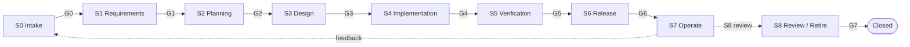

# Agentic SDLC runbook: Order Processing assignment

A single place to run the Take-Home Order Processing assignment through the
process defined in the mounted `agentic-sdlc/` doc set. It holds the paste-ready
prompt for every stage and the approval prompt for every gate. Nothing here
replaces the doc set; it points at it.

Sources this runbook is built from:

- `agentic-sdlc/QUICKSTART.md` section 6 (the canonical stage prompts)
- `agentic-sdlc/docs/01-process.md` (stages, gates, criteria)
- `agentic-sdlc/docs/02-artifacts.md` (artifact catalog, frontmatter, gate packets, quality bars)
- `agentic-sdlc/docs/03-roles.md` (gate authority, segregation of duties, small-team collapse)
- `agentic-sdlc/docs/05-agent-team.md` (executor to reviewer loop, gate mechanism)

Design context for this specific build already exists at
`docs/Order_Processing_System_HLD.md`. S3 consumes it as an input; it is
not itself a gated artifact until it is reissued in the S3 homes with
provenance.

---

## 1. The process in one minute

The lifecycle has **9 stages (S0 to S8)** and **8 transition gates (G0 to G7)**.
A work item flows S0 to S8; S7 runs continuously and feeds back into S0. Every
gate is a human decision over a structured packet. Agents never approve.



The "8 steps" often spoken of are the 7 prompt-driven stages (S0 to S6) plus
kickoff; S7 and S8 are continuous and event-driven rather than a linear prompt.
There are exactly **8 human gates**, G0 through G7.

| Gate | Transition | Packet | Approver (human, always) |
|---|---|---|---|
| G0 | S0 to S1 | A0.1 brief + A0.2 triage | Head of Product |
| G1 | S1 to S2 | A1.1 PRD + A1.4 NFR (+ A1.3 if regulated) + open questions | PM |
| G2 | S2 to S3 | A2.1 stories+ACs, A2.2 breakdown, A2.3 estimates, A2.4 plan, A2.5 risks | EM |
| G3 | S3 to S4 | S3 design shortlist + test strategy (+ threat model if sensitive) | Architect |
| G4 | S3 to main | PR(s) + CI evidence | Tech Lead |
| G5 | S5 to S6 | A5.1 test plan, A5.2 report, security evidence, UAT sign-off | QA Lead |
| G6 | S6 to prod | A6.1 change record, A6.2 manifest, A6.3 rollback, A6.4 notes | EM / Release Manager |
| G7 | S8 to closed | A8.1 post-launch review, A8.2 telemetry, A8.3 debt | PM + EM |

Executor to reviewer loop, inside every stage: a fast executor drafts, an
independent reviewer critiques in a fresh context, up to 5 rounds, then it
escalates to a human. The reviewer sees the artifact and the quality bar, not
the author's reasoning.

---

## 2. Our adoption for this assignment

### 2.1 Mount and repositories

- Doc set is mounted at `agentic-sdlc/` (a git submodule of this repo).
- Adoption mode: **single repository**. Flow artifact homes live under this
  repo's `docs/` rather than a separate development-process repo. `agentic-sdlc/QUICKSTART.md`
  section 3 permits this.
- Tooling: `agentic-sdlc/scripts/alloc-id` allocates ids and scaffolds from
  `agentic-sdlc/templates/`; `agentic-sdlc/scripts/validate` checks frontmatter
  and reference resolution.

### 2.2 Risk tier

Per `docs/02-artifacts.md` section 1.1, this is **tier 2**: a significant domain
workflow (order lifecycle, state machine, background processing). Consequences:

- We produce a brief and a light PRD, stories with ACs, and the touched design
  artifacts.
- We do **not** produce a regulatory matrix or a threat model: the system has no
  personal data, no auth surface, and no tenant boundary in scope. State that
  decision explicitly at G1/G3 rather than silently skipping.
- AI-assisted workflow artifacts (AX.x) do not apply: no agent reads sensitive
  data or writes a system of record in the product.

### 2.3 Roles, collapsed

Per `docs/03-roles.md` section 7, one person wears many hats. For this
assignment every gate approver resolves to me (the candidate). The role names
are kept so the separation survives the walkthrough.

| Human role | Who, here | Gates held |
|---|---|---|
| Head of Product | me | G0 |
| Product Manager | me | G1, G7 |
| Engineering Manager | me | G2, G6, G7 |
| Software Architect | me | G3 |
| Tech Lead | me | G4 |
| QA Lead | me | G5 |
| Compliance / Security | me, consulted only | G1/G3/G5 consults |

Segregation of duties still binds where the process says it must not collapse.
The author of an ADR may not be its sole approver, but with one person the
controls that matter are: I write reasoning down, the reviewer agent critiques
independently, and I record an explicit approve/reject with rationale at each
gate. That recorded decision is the audit evidence.

### 2.4 Artifact homes in this repo

| Stage | Home |
|---|---|
| S0 | `docs/briefs/` |
| S1 | `docs/prd/` |
| S2 | `docs/plans/` |
| S3 | `docs/design/`, `docs/decisions/`, `openapi/` |
| S4 | source tree, `tests/`, `process/` (working records) |
| S5 | `docs/testing/` |
| S6 | `docs/releases/` |
| S7 | `docs/runbooks/`, `docs/postmortems/` |
| S8 | `docs/reviews/` |

### 2.5 AI usage

The assignment grades how AI was used and corrected. Two things run in parallel:

1. Every artifact records provenance (`author.kind: agent`, model id); the
   approver slot stays human and is filled only at a gate.
2. A running `docs/AI_USAGE.md` captures the prompts, what the AI produced,
   what was wrong, and what was changed. The runbook's stage prompts below
   double as the raw material for that log.

---

## 3. Step-by-step prompts

Give one prompt, then stop. Every stage ends by asking me to approve a gate, and
the agent must not press on to the next stage.

Each stage also runs the executor to reviewer loop: draft, then have an
independent reviewer (a fresh subagent, or the `sdlc-reviewer` persona) critique
against the quality bar in `agentic-sdlc/docs/02-artifacts.md` section 6 before
assembling the gate packet.

### 3.1 Executor and reviewer wiring

The executor-reviewer loop is wired by model, per
`agentic-sdlc/docs/05-agent-team.md` section 5. Writer and reviewer use
different models so the review is independent.

| Role | Agent | Model | Mode |
|---|---|---|---|
| Executor (drafts the artifact) | `sdlc-writer` | `deepseek/deepseek-flash` | subagent |
| Reviewer (critiques, fresh context) | `sdlc-reviewer` | `deepseek/deepseek-v4-pro` | subagent (edit denied) |

Both agents are defined in `.opencode/agent/`. Per artifact: dispatch the writer
to produce it, then dispatch the reviewer on the artifact alone, since it must
not see the writer's reasoning. Loop at most 5 rounds, then escalate to me with
the full round history. The reviewer never edits and never approves; the gate is
mine.

### Kickoff (do this once, before S0)

```text
Read agentic-sdlc/docs/index.md, agentic-sdlc/QUICKSTART.md, and
agentic-sdlc/docs/01-process.md. We are adopting the AI-SDLC process for the
Order Processing take-home assignment in this repo, single-repository mode,
mounted at agentic-sdlc/. Confirm the delivery flow, the artifact homes, and the
tooling (agentic-sdlc/scripts/alloc-id and validate) are in place. Treat
docs/Order_Processing_System_HLD.md as S3 input context, not a gated
artifact. Risk tier is 2. List the first artifact to produce. Do not create files
until I confirm.
```

---

### S0 - Intake and Triage

Produces A0.1 Opportunity Brief and A0.2 Triage Record. Approver: Head of Product.

**Stage prompt**

```text
Act as the intake and PM agent per agentic-sdlc/docs/05-agent-team.md. For the
request "Build the backend for an e-commerce Order Processing System: create an
order with multiple items, retrieve order details by id, list orders filtered by
status, update order status (PENDING, PROCESSING, SHIPPED, DELIVERED), cancel an
order only while PENDING, and run a background job that moves PENDING orders to
PROCESSING every 5 minutes", produce an opportunity brief (A0.1) and a triage
record (A0.2) from agentic-sdlc/templates/brief.md and
agentic-sdlc/templates/triage-record.md. Frame the problem, not the solution.
Allocate ids with agentic-sdlc/scripts/alloc-id and store under docs/briefs/.
Run the executor to reviewer loop against the brief and triage quality bars.
Then assemble the G0 packet (A0.1 + A0.2) with a checklist for the Head of
Product. Do not approve and do not advance to S1.
```

**G0 approval prompt**

```text
Assemble the G0 gate packet per agentic-sdlc/docs/02-artifacts.md section 5: the
required artifacts, a checklist with each item linked to evidence, and a
provenance summary. Evaluate it against the G0 criteria in
agentic-sdlc/docs/01-process.md: the problem statement is a problem not a
disguised solution, affected capabilities are identified, a named PM owns it, no
duplicate exists. Present approve or reject with rationale for the Head of Product.
Record the decision on the work item and stop. Advance to S1 only on approval.
```

---

### S1 - Requirements and Definition

Produces A1.1 PRD, A1.4 NFR spec, open-questions list. Approver: PM.

**Stage prompt**

```text
Act as the PM and BA agents per agentic-sdlc/docs/05-agent-team.md. From the
approved brief <BRIEF-ID>, produce a PRD (A1.1) with measurable success criteria
and explicit non-goals, an NFR spec delta (A1.4) with quantified budgets, and an
open-questions list, using agentic-sdlc/templates/prd.md,
agentic-sdlc/templates/nfr-spec-delta.md, and
agentic-sdlc/templates/open-questions.md. This change is not regulated and
touches no personal data, so produce no regulatory matrix; state that decision
explicitly in the PRD. Requirements must be individually testable. Run the
executor to reviewer loop. Assemble the G1 packet for the PM. Do not advance to S2.
```

**G1 approval prompt**

```text
Assemble the G1 gate packet (A1.1 + A1.4 + open questions). Check every PRD
requirement is testable, NFRs are quantified, language is consistent, and open
questions are listed with owners. Present approve or reject with rationale for
the PM. Record the decision and stop. Advance to S2 only on approval.
```

---

### S2 - Planning and Estimation

Produces A2.1 stories with ACs, A2.2 task breakdown, A2.3 estimates, A2.4 plan,
A2.5 risk register. Approver: EM.

**Stage prompt**

```text
Act as the PM and Planner agents per agentic-sdlc/docs/05-agent-team.md. Slice
the approved PRD <PRD-ID> into INVEST stories with testable acceptance criteria
(A2.1), each citing the PRD section it verifies. Then produce the task breakdown
(A2.2, tasks at most 2 days each), estimation record (A2.3), release plan (A2.4),
and risk register (A2.5), using the matching templates under
agentic-sdlc/templates/. Allocate ids and store under docs/plans/ (and stories
under docs/prd/ per agentic-sdlc/docs/02-artifacts.md section 3). Run the
executor to reviewer loop. Assemble the G2 packet for the EM. Do not advance.
```

**G2 approval prompt**

```text
Assemble the G2 gate packet (A2.1 to A2.5). Check every story has testable ACs
traced upstream, every story is broken down, dependencies are explicit, the plan
fits the 2-day budget, and top risks have mitigations and owners. Present approve
or reject with rationale for the EM. Record the decision and stop. Advance to S3
only on approval.
```

---

### S3 - Design

Produces the right-sized design set. Inputs: the approved stories and
`docs/Order_Processing_System_HLD.md`. Approver: Architect.

For this change the shortlist is: A3.1 C4 context/container, A3.2 ADRs, A3.3
OpenAPI contract, A3.4 data model, A3.5 sequence diagrams, A3.9 test strategy.
No threat model (no auth, sensitive data, or tenant paths).

**Stage prompt**

```text
Act as the Architect agent per agentic-sdlc/docs/05-agent-team.md. Right-size
the design set for this change using agentic-sdlc/docs/14-design-artifacts.md,
consuming the approved stories <STORY-IDs> and the existing design context in
docs/Order_Processing_System_HLD.md. Produce: C4 context and container
diagrams (A3.1), ADRs for every significant decision (A3.2) from
agentic-sdlc/templates/adr.md, an OpenAPI contract (A3.3) under openapi/, a data
model and migration design (A3.4), sequence diagrams for the critical flows
(A3.5), and the test strategy (A3.9). Stack is .NET 10, ASP.NET Core, EF Core 10,
Npgsql, PostgreSQL 18, Hangfire. No threat model is required: no auth, personal
data, or tenant boundary is in scope; record that decision. Store under
docs/design/, docs/decisions/, and openapi/. Run the executor to reviewer loop
per artifact. Assemble the G3 packet for the Architect. Do not advance.
```

**G3 approval prompt**

```text
Assemble the G3 gate packet (design shortlist + test strategy + threat-model
status). Check contracts are concrete enough to code against and validate, the
data model is reviewed, ADRs exist for every significant decision, and the test
strategy covers the acceptance criteria. Confirm the explicit no-threat-model
decision is justified. Present approve or reject with rationale for the
Architect. Record the decision and stop. Advance to S4 only on approval.
```

---

### S4 - Implementation

Produces merged PRs, tests, migrations, and per-story working records. Approver:
Tech Lead (human PR approval is the gate).

**Stage prompt**

```text
Act as the engineering agent per agentic-sdlc/docs/05-agent-team.md. Implement
story <STORY-ID> from the task breakdown, with tests at the right level
(unit for domain transitions and invariants, integration with Testcontainers
PostgreSQL for endpoints and the Hangfire job), on a branch per
agentic-sdlc/docs/10-delivery-workflow.md. Add EF Core migrations. Keep the
OpenAPI contract and ADRs in sync; a discovered design gap reopens the ADR
instead of being coded around. Write the story working record (A4.9) and the
story review register (A4.10) under process/. Run agentic-sdlc/scripts/validate
before opening the PR. The PR review and merge are G4; a human Tech Lead
approves, you do not.
```

**G4 approval prompt**

```text
Assemble the G4 gate packet: the PR(s) plus CI evidence (build, static analysis,
contract validation, SBOM). Check CI is green, there are no unresolved review
threads, and any high-impact calculation code has a second human reviewer.
Present approve or reject with rationale for the Tech Lead. Merge only on human
approval. Stop.
```

---

### S5 - Verification and Quality

Produces A5.1 test plan, A5.2 test report, A5.4 security evidence, A5.5 UAT
sign-off. Approver: QA Lead.

**Stage prompt**

```text
Act as the QA agent per agentic-sdlc/docs/05-agent-team.md. Author a test plan
(A5.1) from the story acceptance criteria, run the test pyramid (domain unit
tests, integration tests against real PostgreSQL via Testcontainers, endpoint
contract checks), and assemble the G5 evidence: test report (A5.2), coverage,
security scan evidence (A5.4), and UAT sign-off (A5.5) confirming the product
does what the PRD said. Store under docs/testing/. Present the G5 packet for the
QA Lead. Do not advance.
```

**G5 approval prompt**

```text
Assemble the G5 gate packet (A5.1, A5.2, A5.4, A5.5). Check zero critical or high
defects are open, NFR budgets are met or waived, security scans are clean or
risk-accepted, and UAT is signed. Present approve or reject with rationale for
the QA Lead. Record the decision and stop. Advance to S6 only on approval.
```

---

### S6 - Release and Deployment

Produces A6.1 change record, A6.2 deployment manifest, A6.3 rollback plan, A6.4
release notes. Approver: EM / Release Manager.

For a take-home, "production" is the local docker compose environment plus a
README that reproduces it. Say so honestly in the change record.

**Stage prompt**

```text
Act as the release agent per agentic-sdlc/docs/05-agent-team.md. Assemble the G6
packet: change record (A6.1), deployment manifest (A6.2), rollback plan (A6.3),
and release notes (A6.4), using the templates available and storing under
docs/releases/. Deployment for this assignment is the local docker compose
environment (PostgreSQL 18 plus the API) plus migrations applied on startup;
state that scope explicitly. Present the packet for the EM or Release Manager.
Deploy only after the human approves.
```

**G6 approval prompt**

```text
Assemble the G6 gate packet (A6.1 to A6.4). Check the change record is complete
with G5 evidence linked, the rollback plan is real, and the release notes match
what shipped. Present approve or reject with rationale for the EM / Release
Manager. Record the decision. Stop.
```

---

### S7 - Operate and Monitor (continuous, event-driven)

No linear prompt. Produces SLO definitions, dashboards/alerts as code, runbooks,
and (on incident) postmortems. Approver for postmortems: EM.

```text
Act as the SRE agent per agentic-sdlc/docs/05-agent-team.md. Define SLO/SLI
targets (A7.1), alert rules and dashboards as code (A7.2), and runbooks for the
known failure modes (A7.3) of the order processing service: background job
failure, database unavailability, and concurrency conflicts. Store under
docs/runbooks/. This is continuous; there is no gate. Present the set for the
SRE Lead to review.
```

---

### S8 - Review, Iterate and Retire

Produces A8.1 post-launch review, A8.2 adoption/telemetry report, A8.3 debt
register delta. Approver: PM + EM (jointly). Gate: G7.

```text
Act as the PM agent per agentic-sdlc/docs/05-agent-team.md. Produce the
post-launch review (A8.1) against the brief's success criteria, the
adoption/telemetry report (A8.2), and the tech debt register delta (A8.3),
storing under docs/reviews/. Run the executor to reviewer loop. Assemble the G7
packet for joint PM + EM approval. Do not close without the recorded decision.
```

**G7 approval prompt**

```text
Assemble the G7 gate packet (A8.1 to A8.3). Check the success criteria are marked
met or missed with reasons, learnings are captured as ADRs or process changes,
and any debt is recorded with owners. Present approve or reject with rationale
for the PM and EM jointly. Record the decision. Stop.
```

---

## 4. Reusable gate-approval prompt

Use when you want the packet assembled for any gate without running the stage
again:

```text
Assemble the G<n> gate packet per agentic-sdlc/docs/02-artifacts.md section 5:
the required artifacts, a checklist with each item linked to evidence, and a
provenance summary. Present it for <approver role> to approve or reject. Do not
advance the stage until the decision and rationale are recorded on the work item.
```

---

## 5. Gate decision log

Fill this in as each gate is passed. It is the audit trail for the walkthrough.

| Gate | Artifacts | Decision | Rationale | Date |
|---|---|---|---|---|
| G0 | A0.1, A0.2 | approved | Problem framed without solution smuggling; capabilities identified; named PM owns it; no duplicate; four open questions deferred to S1 with owners and due dates. | 2026-10-09 |
| G1 | A1.1, A1.4, OQ-0001 | approved | All 10 FRs testable; NFR budgets quantified; language consistent; four upstream open questions closed and two carried open with owners and due dates; no regulatory matrix required. | 2026-10-09 |
| G2 | A2.1 to A2.5 | approved | Every story testable and traced to an FR or NFR; all eight stories broken down; dependency graph acyclic; plan reconciles 14.5 agent-executed days against a ~2-day human budget openly; risks mitigated and owned. | 2026-10-09 |
| G3 | ADR-0001..0008, DOC-0001..0004, openapi contract, TP-0001 | approved | Contract: OpenAPI 3.1 clamps over-100 list requests, shared error shape requires a correlation id. Data model reviewed with a portable `version` concurrency column. ADRs cover every significant decision including architecture style (modular monolith) and concurrency (version column, not Postgres `xmin`, a human correction from AI suggestion). Deployment and async posture documented with future evolution. Explicit no-threat-model decision justified. | 2026-10-09 |
| G4 | PR + CI | pending | | |
| G5 | A5.1, A5.2, A5.4, A5.5 | pending | | |
| G6 | A6.1 to A6.4 | pending | | |
| G7 | A8.1 to A8.3 | pending | | |

**Controlled delta, 2026-10-09 (PM):** approved. NFR-0001 was amended to close the design-context NFR gaps (horizontal scalability, interface contract and error model, operability, and a correlation identifier on observability); stories PRD-0001-S09 to S11 were added with tasks; PLAN-0001/2/3 and RISK-0001 were updated; `docs/FUTURE_PHASES.md` was added as the home for deferred functional and non-functional extensions, including item-level order status. Review loop: 3 rounds, approved.

---

## 6. AI usage discipline

Keep `docs/AI_USAGE.md` current as we go. For each stage, capture:

- The prompt given (the stage prompt above, plus any clarifications).
- What the agent produced.
- What was wrong, weak, or over-engineered.
- What a human changed and why.
- Which decision was the human's own.

The assignment explicitly asks for this, and the process makes it natural:
provenance frontmatter records authorship, and gate decisions record human
judgment.

---

## 7. Commands cheat sheet

```bash
# allocate an id and scaffold the matching template
agentic-sdlc/scripts/alloc-id brief --title "Order Processing backend" \
  --author-kind agent --author-name pm-agent --model <model-id> \
  --work-item <work-item-id>

# validate frontmatter, id uniqueness, and reference resolution
agentic-sdlc/scripts/validate --root docs --json
```

Current work item: the Order Processing take-home assignment. Next action: run
the Kickoff prompt, then the S0 prompt. Stop at G0.
