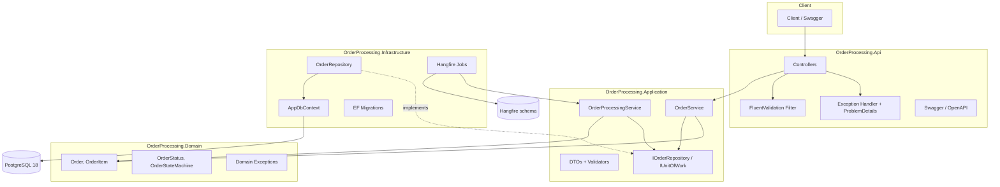
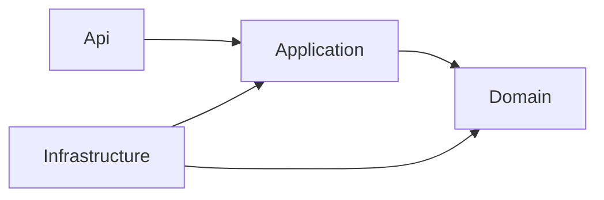
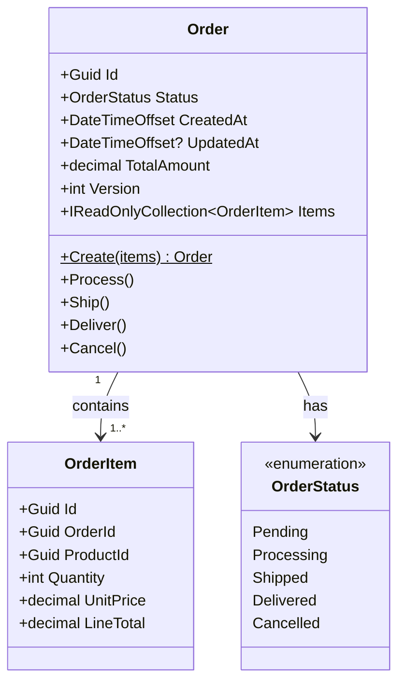
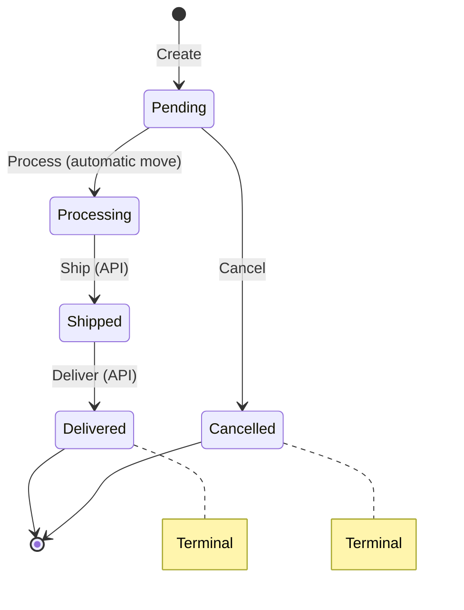
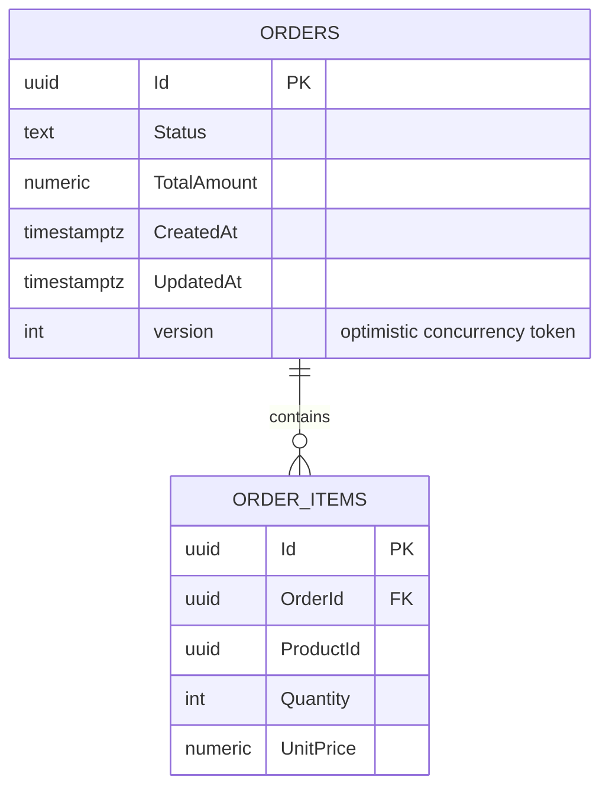
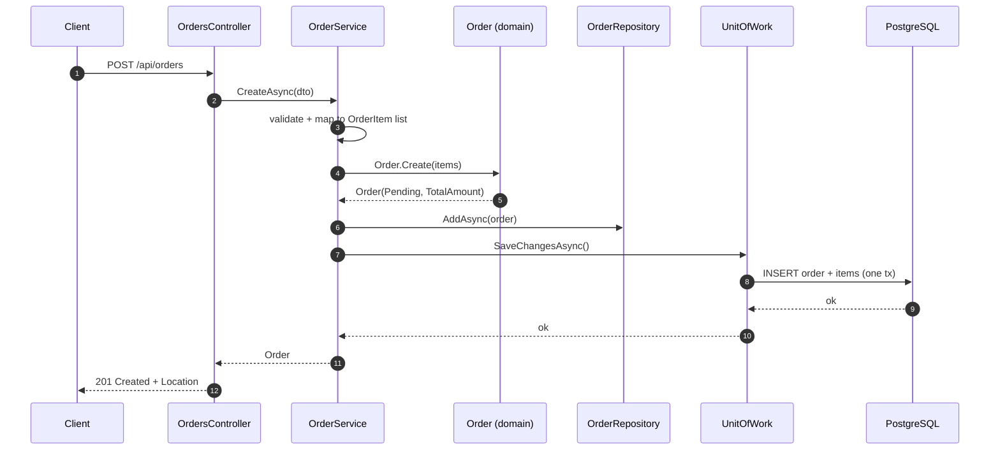
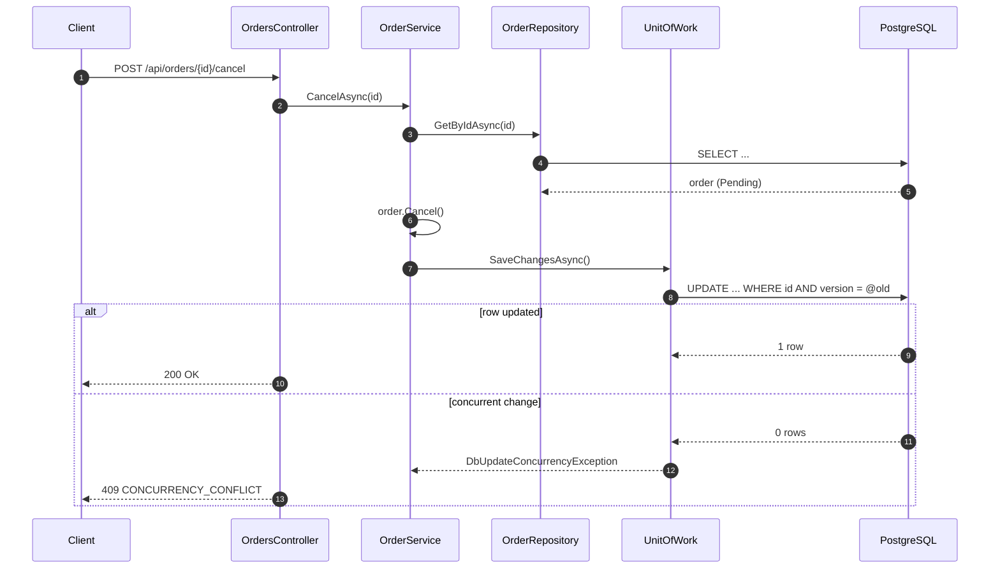
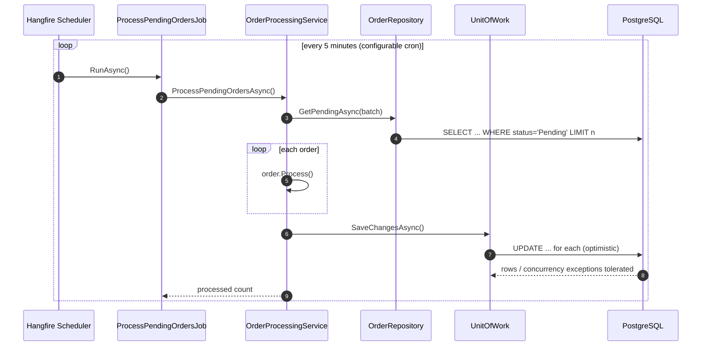
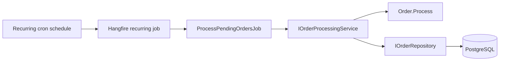
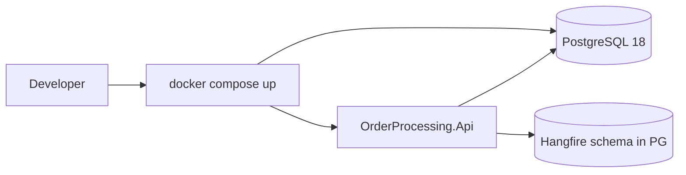

# Order Processing System — High-Level Design (HLD)

| Field | Value |
| --- | --- |
| Status | Draft — candidate design for take-home assignment |
| Audience | Reviewer (walkthrough) + implementer (self) |
| Stack | .NET 10 · ASP.NET Core · EF Core 10 · Npgsql · PostgreSQL 18 · Hangfire |
| Time budget | ~2 days |

This document is the **single source of truth** for the design. Where an earlier note was
inconsistent (for example a `CustomerId`/`TotalAmount` that appeared in the schema but not in
the entity or API), this document corrects it explicitly under
[Corrections to prior notes](#corrections-to-prior-notes).

---

## 1. Problem & Goals

Build the backend for an E-commerce **Order Processing System** that lets customers place orders,
track status, list/filter orders, update status, and cancel — with a background job that moves
`PENDING` orders to `PROCESSING` automatically.

The assignment is small. The evaluation is about **judgement**: correct business rules, clean
separation of concerns, testability, concurrency awareness, scalability thinking, and honest
AI-assisted development.

### Goals

- Correct implementation of all five functional requirements.
- Business invariants enforced in the **domain**, not the controller.
- Clean, layered architecture with a one-way dependency direction.
- Testable without waiting on real time or a live database.
- Production-minded but **not over-engineered**.

### Non-goals (explicitly out of scope)

Authentication/authorization, payments, inventory reservation, notifications, microservices,
event sourcing/CQRS, multi-tenancy, cloud deployment, full distributed sagas. Each is listed in
[Scalability & Production Evolution](#15-scalability--production-evolution) as a *future* step with a trigger.

---

## 2. Requirements

### 2.1 Functional

| # | Requirement | Notes |
| --- | --- | --- |
| FR-1 | Create an order with multiple items | Validate non-empty, qty > 0, price >= 0 |
| FR-2 | Retrieve order details by ID | 404 when absent |
| FR-3 | List orders, optionally filtered by status | Paged, stable ordering |
| FR-4 | Update order status | `PENDING→PROCESSING` automatic; `PROCESSING→SHIPPED→DELIVERED` manual |
| FR-5 | Cancel an order only when `PENDING` | 409 conflict otherwise |
| FR-6 | Background job: `PENDING→PROCESSING` every 5 minutes | Interval configurable |
| FR-7 | Document AI usage | `docs/AI_USAGE.md` |

### 2.2 Non-functional

| # | Quality | Target |
| --- | --- | --- |
| NFR-1 | Correctness under concurrency | Cancellation and the job must not both mutate a `PENDING` order (lost update) |
| NFR-2 | Testability | Full suite runs with one command; no 5-minute waits; real Postgres via Testcontainers |
| NFR-3 | Observability | Structured logs, metrics, traces, correlation IDs, health checks |
| NFR-4 | Horizontal scalability | Stateless API; job safe under multiple instances |
| NFR-5 | API quality | OpenAPI/Swagger, RFC 7807 errors, meaningful status codes |
| NFR-6 | Operability | One-command run (docker compose), migrations on startup |

---

## 3. Polyglot / Stack Decision

"Why .NET, and what would you do in another language?" is a first-class question for this role.

### 3.1 Evaluation criteria

1. Domain modeling expressiveness (invariants, value objects).
2. Concurrency model and correctness primitives.
3. Background processing maturity (scheduling, retries, visibility).
4. Ecosystem fit (ORM, migrations, test tooling).
5. Delivery speed within a 2-day budget.

### 3.2 Chosen stack and rationale

| Concern | Choice | Why |
| --- | --- | --- |
| Language/runtime | **C# / .NET 10** | Strong static typing, records for value objects, DI built in, excellent async, single mature runtime for API + worker |
| Web | **ASP.NET Core controllers** | Explicit routing, easy filters/exception handling; Minimal APIs noted as alternative |
| ORM | **EF Core 10 + Npgsql** | Change tracking, concurrency tokens, migrations, testability |
| DB | **PostgreSQL 18** | Transactions for state changes, strong concurrency support, an explicit `version` column for optimistic concurrency, JSONB if needed later |
| Jobs | **Hangfire** | Persistent recurring jobs, retry + dashboard, **distributed locking** across instances |
| Validation | **FluentValidation** | Declarative, edge-level validation separate from domain rules |
| Tests | **xUnit + FluentAssertions + Testcontainers** | Real Postgres, readable assertions |
| Logs/metrics | **Serilog + OpenTelemetry** | Structured, correlated, exportable |

### 3.3 Idiomatic contrast (how the same design maps elsewhere)

| Concept | C# / .NET 10 | Go | TypeScript/NestJS | Python/FastAPI |
| --- | --- | --- | --- | --- |
| Value object | `record` | struct + constructor | class + `readonly` | `@dataclass(frozen=True)` |
| Invariant guard | domain method throws | `error` return | exception | exception |
| Repository | interface + EF | interface + pgx | provider | service + SQLAlchemy |
| Concurrency token | explicit `version` column | `UPDATE ... WHERE version=` | `@VersionColumn` | SQLAlchemy `version_id_col` |
| Background job | Hangfire / `BackgroundService` | ticker + `context` | `@nestjs/schedule` / BullMQ | APScheduler / Celery |
| Structured errors | ProblemDetails | custom JSON | `HttpException` | `HTTPException` |

The point for the walkthrough: the **design is transportable**; only idioms change.

### 3.4 Hangfire vs `BackgroundService`

| Aspect | `BackgroundService` | **Hangfire (chosen)** |
| --- | --- | --- |
| Persistence | none (in-memory tick) | recurring job stored in Postgres |
| Retries | hand-rolled | built-in with backoff |
| Multi-instance | needs custom lock | **distributed lock per recurring job** |
| Visibility | logs only | dashboard + failed-job inspection |
| Complexity | minimal, no dependency | one storage package + schema |

**Decision:** use Hangfire as the scheduler, but keep the **processing logic in an application
service** (`IOrderProcessingService`) so it is testable and could be swapped to a
`BackgroundService` (or a queue consumer) without touching domain code. This directly answers
"why Hangfire" *and* "what if I can't use a library".

---

## 4. High-Level Architecture



Dependency direction (allowed references only downward / inward):



The **Domain** depends on nothing. **Application** depends on Domain. **Infrastructure** and
**Api** are composition roots and implement/adapter to the inner layers.

### 4.1 Project layout

```text
OrderProcessing.sln
├── src/
│   ├── OrderProcessing.Api/            # controllers, middleware, DI, Program.cs
│   ├── OrderProcessing.Application/    # services, DTOs, validators, interfaces
│   ├── OrderProcessing.Domain/         # entities, enums, state machine, exceptions
│   └── OrderProcessing.Infrastructure/ # DbContext, repositories, migrations, Hangfire
├── tests/
│   ├── OrderProcessing.UnitTests/
│   └── OrderProcessing.IntegrationTests/
├── docker-compose.yml                  # PostgreSQL 18
└── README.md
```

### 4.2 Application interfaces

The Application layer talks to persistence only through these abstractions, so EF Core never leaks
outward. The **Unit of Work** owns the commit boundary; repositories never call `SaveChanges`.

```csharp
public interface IOrderRepository
{
    Task<Order?> GetByIdAsync(Guid id, CancellationToken ct = default);
    Task<IReadOnlyList<Order>> GetAsync(OrderStatus? status, int page, int pageSize, CancellationToken ct = default);
    Task<IReadOnlyList<Order>> GetPendingAsync(int batchSize, CancellationToken ct = default);
    void Add(Order order);
}

public interface IUnitOfWork
{
    IOrderRepository Orders { get; }
    Task<int> SaveChangesAsync(CancellationToken ct = default);
}
```

One unit of work spans one request (or one job batch): all mutations are committed atomically in a
single transaction.

---

## 5. Domain Model



### 5.1 Invariants (enforced in the entity)

- An order must have **at least one** item.
- Each item: `Quantity > 0`, `UnitPrice >= 0`.
- `TotalAmount` is **derived**, never set from outside (sum of `Quantity * UnitPrice`).
- Status changes only through named domain methods; no public setter.
- Only `PENDING` may be cancelled.

```csharp
public sealed class Order
{
    private readonly List<OrderItem> _items = [];

    private Order(Guid id, DateTimeOffset createdAt, IEnumerable<OrderItem> items)
    {
        if (!items.Any())
            throw new DomainException("ORDER_EMPTY", "An order must contain at least one item.");

        Id = id;
        Status = OrderStatus.Pending;
        CreatedAt = createdAt;
        _items.AddRange(items);
    }

    public Guid Id { get; }
    public OrderStatus Status { get; private set; }
    public DateTimeOffset CreatedAt { get; }
    public DateTimeOffset? UpdatedAt { get; private set; }
    public decimal TotalAmount => _items.Sum(i => i.LineTotal);
    public int Version { get; private set; }
    public IReadOnlyCollection<OrderItem> Items => _items;

    public static Order Create(IEnumerable<OrderItem> items) =>
        new(Guid.NewGuid(), DateTimeOffset.UtcNow, items);

    public void Process()
    {
        EnsureStatus(OrderStatus.Pending, "ORDER_INVALID_STATE", "Only pending orders can be processed.");
        TransitionTo(OrderStatus.Processing);
    }

    public void Ship()
    {
        EnsureStatus(OrderStatus.Processing, "ORDER_INVALID_STATE", "Only processing orders can be shipped.");
        TransitionTo(OrderStatus.Shipped);
    }

    public void Deliver()
    {
        EnsureStatus(OrderStatus.Shipped, "ORDER_INVALID_STATE", "Only shipped orders can be delivered.");
        TransitionTo(OrderStatus.Delivered);
    }

    public void Cancel()
    {
        EnsureStatus(OrderStatus.Pending, "ORDER_NOT_CANCELLABLE", "Only pending orders can be cancelled.");
        TransitionTo(OrderStatus.Cancelled);
    }

    private void EnsureStatus(OrderStatus expected, string code, string message)
    {
        if (Status != expected)
            throw new DomainException(code, message);
    }

    private void TransitionTo(OrderStatus next)
    {
        Status = next;
        UpdatedAt = DateTimeOffset.UtcNow;
        Version++;
    }
}
```

### 5.2 State machine



Allowed transitions table (the single authority used by the domain methods):

| From | To | Trigger | Actor |
| --- | --- | --- | --- |
| PENDING | PROCESSING | `Process()` | background job only |
| PENDING | CANCELLED | `Cancel()` | customer |
| PROCESSING | SHIPPED | `Ship()` | fulfillment / API |
| SHIPPED | DELIVERED | `Deliver()` | fulfillment / API |
| any | same state | no-op (`200`) | any caller on the status endpoint |
| any terminal | — | rejected with `INVALID_ORDER_STATE` | — |

The status endpoint exposes only `PROCESSING→SHIPPED` and `SHIPPED→DELIVERED`; a same-status
request is a `200` no-op. `PENDING→PROCESSING` belongs to the automatic move alone. The earlier
admin/testing override for that transition is deliberately deferred (see §7.2 and §19).

---

## 6. Data Model



### 6.1 Persistence decisions

| Decision | Choice | Reason |
| --- | --- | --- |
| Key type | `Guid` (UUID) | Client-safe, no sequence leak |
| Status storage | `text` (string enum) | Readable in DB, matches JSON serialization via `JsonStringEnumConverter` |
| Money | `numeric(18,2)` | No floating point drift; `decimal` in C# |
| Timestamps | `timestamptz` (UTC) | Avoids DST/offset bugs; `DateTimeOffset` in C# |
| Concurrency | explicit integer `version` column, incremented on each write | Portable across relational databases; DB-enforced by the update predicate |
| `TotalAmount` | persisted denormalized | Fast list/read; computed from items at write time |

### 6.2 Indexes

| Index | Columns | Purpose |
| --- | --- | --- |
| `ORDERS(id)` (PK) | `id` | primary-key lookups for retrieve and every change |
| `ORDERS(status, created_at, id)` | `status, created_at, id` | filtered list and the job scan of `PENDING`; the trailing `id` makes the deterministic tie-break an index order, not a sort |
| `ORDERS(created_at, id)` | `created_at, id` | unfiltered list ordered by creation time, with the same tie-break |
| `ORDER_ITEMS(order_id)` | `order_id` | load items per order, and support the cascade delete |

There is no standalone index on `Status`: the composite index leads with it, so a status-only
index would be a redundant second copy. The list bound is a limit, not an offset, so no
pagination index is needed beyond the ordering.

`CustomerId` is **deliberately omitted** (not required by the assignment). If a customer concept is
added later it becomes `ORDERS(CustomerId)` + a `Customers` table.

### 6.3 EF Core configuration (excerpt)

```csharp
protected override void OnModelCreating(ModelBuilder b)
{
    b.Entity<Order>(e =>
    {
        e.ToTable("orders");
        e.HasKey(o => o.Id);
        e.Property(o => o.Status).HasConversion<string>().HasMaxLength(20);
        e.Property(o => o.TotalAmount).HasPrecision(18, 2);
        e.Property(o => o.CreatedAt).HasColumnType("timestamptz");
        e.Property(o => o.UpdatedAt).HasColumnType("timestamptz");
        e.Property(o => o.Version).IsConcurrencyToken();
        e.HasMany(o => o.Items).WithOne().HasForeignKey(i => i.OrderId)
            .OnDelete(DeleteBehavior.Cascade);
        e.Navigation(o => o.Items).UsePropertyAccessMode(PropertyAccessMode.Field);
        e.HasIndex(o => new { o.Status, o.CreatedAt, o.Id });
        e.HasIndex(o => new { o.CreatedAt, o.Id });
    });

    b.Entity<OrderItem>(e =>
    {
        e.ToTable("order_items");
        e.HasKey(i => i.Id);
        e.Property(i => i.UnitPrice).HasPrecision(18, 2);
    });
}
```

---

## 7. API Design

Base: `/api/orders`

| Method | Path | Purpose | Success | Failure |
| --- | --- | --- | --- | --- |
| POST | `/api/orders` | Create order | 201 + `Location` | 400 |
| GET | `/api/orders/{id}` | Get by id | 200 | 400/404 |
| GET | `/api/orders?status=Pending&page=1&pageSize=20` | List/filter | 200 | 400 |
| PATCH | `/api/orders/{id}/status` | Update status | 200 | 400/404/409 |
| POST | `/api/orders/{id}/cancel` | Cancel | 200 | 404/409 |

### 7.1 Create order

Request:

```json
{
  "items": [
    { "productId": "5e1c...", "quantity": 2, "unitPrice": 100.00 },
    { "productId": "9ab3...", "quantity": 1, "unitPrice": 250.00 }
  ]
}
```

Response `201 Created`:

```json
{
  "id": "3f2b...",
  "status": "Pending",
  "totalAmount": 450.00,
  "createdAt": "2026-10-09T10:00:00Z",
  "items": [
    { "productId": "5e1c...", "quantity": 2, "unitPrice": 100.00, "lineTotal": 200.00 },
    { "productId": "9ab3...", "quantity": 1, "unitPrice": 250.00, "lineTotal": 250.00 }
  ]
}
```

### 7.2 Update status (previously under-specified — now defined)

Request:

```json
{ "status": "Shipped" }
```

Rules:

- The endpoint accepts only **manual, forward** transitions: `PROCESSING→SHIPPED` and
  `SHIPPED→DELIVERED`.
- `PENDING→PROCESSING` is the **automatic move's alone**. The endpoint does not expose it; the
  earlier admin/testing override for that transition is deliberately deferred (see §19, R-2).
- It **rejects** terminal targets and any transition not in the state table (§5.2) with
  `409 Conflict` + `INVALID_ORDER_STATE`.
- It maps the requested status to the **domain method** (`Ship` or `Deliver`); the controller
  never assigns `order.Status`.
- Setting the *same* status is an idempotent no-op returning `200`.

```csharp
[HttpPatch("{id:guid}/status")]
public async Task<IActionResult> UpdateStatus(Guid id, UpdateStatusRequest req, CancellationToken ct)
{
    var order = await _service.UpdateStatusAsync(id, req.Status, ct);
    return Ok(_mapper.ToDto(order));
}
```

### 7.3 Status codes

| Situation | Status | Error code |
| --- | --- | --- |
| Validation failure | 400 | `VALIDATION_ERROR` |
| Malformed/invalid id | 400 | `INVALID_ID` |
| Order not found | 404 | `ORDER_NOT_FOUND` |
| Invalid transition / cancel non-pending | 409 | `INVALID_ORDER_STATE` / `ORDER_NOT_CANCELLABLE` |
| Concurrency conflict (retry exhausted) | 409 | `CONCURRENCY_CONFLICT` |
| Unexpected | 500 | `INTERNAL_ERROR` |

---

## 8. Key Flows

### 8.1 Create order



### 8.2 Cancel order



### 8.3 Background processing (Hangfire)



### 8.4 The race: cancel vs. job

```mermaid
sequenceDiagram
    autonumber
    participant C as Customer
    participant JOB as Background Job
    participant DB as PostgreSQL (orders)

    C->>DB: SELECT order (version=7) -> Pending
    JOB->>DB: SELECT order (version=7) -> Pending
    C->>DB: UPDATE status=Cancelled WHERE id AND version=7
    DB-->>C: 1 row (version now 8)
    JOB->>DB: UPDATE status=Processing WHERE id AND version=7
    DB-->>JOB: 0 rows -> DbUpdateConcurrencyException
    Note over JOB: skip / log / continue batch
    Note over C: customer wins; no lost update
```

---

## 9. Background Processing

### 9.1 Design



- **Scheduler** = Hangfire `RecurringJob` with a cron expression.
- **Processor** = `OrderProcessingService.ProcessPendingOrdersAsync()` — pure application logic,
  independently testable, no Hangfire dependency.
- The job handler is a thin adapter that resolves the scoped service and delegates.

```csharp
public sealed class ProcessPendingOrdersJob(IServiceScopeFactory scopeFactory)
{
    public async Task RunAsync(CancellationToken ct)
    {
        using var scope = scopeFactory.CreateScope();
        var svc = scope.ServiceProvider.GetRequiredService<IOrderProcessingService>();
        await svc.ProcessPendingOrdersAsync(ct);
    }
}
```

### 9.2 Configuration (never hard-code 5 minutes)

```json
{
  "OrderProcessing": {
    "CronExpression": "*/5 * * * *",
    "BatchSize": 200
  }
}
```

```csharp
RecurringJob.AddOrUpdate<ProcessPendingOrdersJob>(
    "process-pending-orders",
    job => job.RunAsync(CancellationToken.None),
    options.CronExpression);
```

Tests configure `CronExpression` to a fast value **or** call
`ProcessPendingOrdersAsync()` directly — no time-based waits.

### 9.3 Reliability

| Concern | Handling |
| --- | --- |
| Overlapping ticks | Hangfire acquires a distributed lock per recurring job; only one runs |
| Multiple instances | Same distributed lock; safe to scale out |
| Crash / restart | Job state persisted in Postgres; missed run rescheduled |
| Partial failure | Per-order try/catch; a queue-level concurrency exception is logged and skipped, batch continues |
| DB down | Exception surfaces to Hangfire → automatic retry with backoff |
| Long batch | Batched + bounded `BatchSize`; progress logged |
| Graceful shutdown | `CancellationToken` flows DB calls; `HostOptions.ShutdownTimeout` configured |

---

## 10. Concurrency & Consistency

**The core risk:** two actors read `PENDING` and both act — one cancels, the job advances. Last
write wins → lost update, possibly a `CANCELLED` order that was also `PROCESSING`.

### 10.1 Chosen strategy — optimistic concurrency

- Add an integer `version` column to `Order` and configure it as a concurrency token. Application
  code increments it on each write, and EF appends `AND version = @original` to every
  `UPDATE`/`DELETE`. The column is ordinary schema, so the mechanism is portable across relational
  databases rather than tied to a system column.
- If 0 rows are affected → `DbUpdateConcurrencyException`.
- On conflict: **reload** the entity and either re-evaluate or fail with `409 CONCURRENCY_CONFLICT`
  (for API) / log-and-skip (for the job).

```csharp
try
{
    order.Cancel();
    await _unitOfWork.SaveChangesAsync(ct);
}
catch (DbUpdateConcurrencyException)
{
    throw new ConcurrencyConflictException(order.Id);
}
```

Why not pessimistic locking / distributed lock: the critical section is tiny, order volume is low,
and optimistic concurrency avoids holding DB locks while doing I/O — the standard choice for this
shape of problem.

### 10.2 Consequence for the domain

The **state guard in `Order` plus the `version` token together** guarantee:

- You cannot cancel a non-`PENDING` order (domain).
- You cannot overwrite a concurrent change (DB).
- The job is naturally **idempotent**: `Process()` on an already-`PROCESSING` order throws
  `INVALID_ORDER_STATE`, which the job treats as "already handled".

### 10.3 Isolation

Default `READ COMMITTED` is sufficient. Each command mutates a single aggregate in a single
transaction; no cross-row invariants require `SERIALIZABLE`.

---

## 11. Validation & Error Handling

### 11.1 Two layers, deliberately separated

| Layer | Checks | Example |
| --- | --- | --- |
| Edge (FluentValidation) | shape, required, ranges, enum membership | `items` non-empty, `quantity > 0`, `unitPrice >= 0`, valid `status` string |
| Domain (entity) | business rules, state transitions | cancel only from `PENDING`, no empty order at construction |

Rationale: "Is the request well-formed?" vs "Is this operation legal for this order?" They fail
differently (400 vs 409) and belong in different places.

### 11.2 Centralized errors (RFC 7807)

Use ASP.NET Core ProblemDetails + `IExceptionHandler`. No per-controller try/catch.

```csharp
public sealed class DomainExceptionHandler : IExceptionHandler
{
    public async ValueTask<bool> TryHandleAsync(
        HttpContext ctx, Exception ex, CancellationToken ct)
    {
        if (ex is not DomainException de) return false;

        ctx.Response.StatusCode = de.Code switch
        {
            "ORDER_NOT_FOUND" => StatusCodes.Status404NotFound,
            "ORDER_NOT_CANCELLABLE" or "INVALID_ORDER_STATE" => StatusCodes.Status409Conflict,
            _ => StatusCodes.Status400BadRequest
        };

        await ctx.Response.WriteAsJsonAsync(new ProblemDetails
        {
            Status = ctx.Response.StatusCode,
            Title = de.Code,
            Detail = de.Message,
            Extensions = { ["traceId"] = ctx.TraceIdentifier }
        }, ct);

        return true;
    }
}
```

Example payload:

```json
{
  "type": "https://httpstatuses.io/409",
  "title": "ORDER_NOT_CANCELLABLE",
  "status": 409,
  "detail": "Only pending orders can be cancelled.",
  "traceId": "00-8f...-01"
}
```

---

## 12. Observability

| Pillar | Implementation | Notes |
| --- | --- | --- |
| Logs | Serilog structured JSON | include `OrderId`, `OldStatus`, `NewStatus`, `CorrelationId` |
| Metrics | OpenTelemetry (`Meter`) | `orders.created`, `orders.cancelled`, `orders.processed`, job duration |
| Traces | OpenTelemetry (`ActivitySource`) | spans around service + DB calls |
| Correlation | W3C `traceparent` propagated | surfaces as `traceId` in ProblemDetails |
| Health | `/health/live`, `/health/ready` | readiness includes DB + Hangfire storage |

```csharp
_logger.LogInformation(
    "Order {OrderId} transitioned {OldStatus} -> {NewStatus}",
    order.Id, oldStatus, order.Status);
```

Never log request bodies with PII or secrets.

---

## 13. Security

Even though auth is out of scope, state the trust boundaries:

- **Trust boundary:** all HTTP input is untrusted; validated at the edge.
- **Injection:** EF Core parameterizes queries; no string-concatenated SQL.
- **Enum/overflow safety:** enum parsing is strict (`JsonStringEnumConverter` + validation);
  `decimal` for money; integer quantity bounded.
- **Headers:** standard middleware — HSTS, `X-Content-Type-Options`.
- **Auth plug-in point:** `PATCH /status` (administrative) is where a policy would be enforced
  (`[Authorize(Policy = "Fulfillment")]`), and `POST /cancel` would require the caller to own the
  order. Documented, not implemented, to respect scope.

---

## 14. Testing Strategy

```mermaid
flowchart TB
    subgraph Unit
        U1[Order state transitions]
        U2[Cancellation rules]
        U3[TotalAmount calculation]
        U4[Validation rules]
    end
    subgraph Integration
        I1[API endpoints via WebApplicationFactory]
        I2[EF Core against real Postgres (Testcontainers)]
        I3[Hangfire job handler end-to-end]
    end
    subgraph Processing
        P1[ProcessPendingOrdersAsync idempotency]
        P2[Concurrency conflict handling]
    end
```

### 14.1 Unit tests (domain-first, no DB)

| Area | Cases |
| --- | --- |
| Create | valid; empty items; qty 0/negative; price negative; total math |
| Process | `PENDING→PROCESSING`; non-pending rejected |
| Ship/Deliver | valid chain; out-of-order rejected |
| Cancel | `PENDING→CANCELLED`; PROCESSING/SHIPPED/DELIVERED/CANCELLED rejected |

### 14.2 Integration tests

- `WebApplicationFactory<Program>` + Testcontainers Postgres 18.
- Cover each endpoint incl. error paths (404, 400, 409).
- Job: seed `PENDING`, call `ProcessPendingOrdersAsync()`, assert `PROCESSING`; assert
  `CANCELLED`/already-`PROCESSING` untouched.

### 14.3 Concurrency test

Two parallel `SaveChangesAsync` on the same order → exactly one succeeds, the other throws
`DbUpdateConcurrencyException`. This is the test that proves NFR-1.

### 14.4 Attributes / property-style tests (optional, high-signal)

- "Any order returned by the API always satisfies the state table" — generate random transition
  sequences and assert no illegal state is ever observable.

---

## 15. Scalability & Production Evolution

Deliberately **not implemented now**; each row states the trigger.

| Concern | Now | Trigger to evolve |
| --- | --- | --- |
| API scaling | stateless, scale horizontally | sustained load |
| Job scaling | Hangfire distributed lock | high volume → shard by status/region |
| Job throughput | batch `GET PENDING` | millions → cursor/batch with `FOR UPDATE SKIP LOCKED` or a queue |
| Read load | indexes + pagination | read replicas + cache |
| Write spikes | single DB | partition `orders` / move to queue with **outbox** |
| API abuse | — | rate limiting, API keys |
| Duplicate submits | — | `Idempotency-Key` header |
| Notifications | — | domain events + outbox → broker (RabbitMQ/Kafka) |
| Multi-service | monolith | only when independent scaling/deploy/team ownership justifies it |

`FOR UPDATE SKIP LOCKED` is the natural next step for the job when multiple workers compete, but
it is unnecessary while Hangfire's lock serializes the recurring job.

---

## 16. Edge-Case Matrix

| Area | Case | Expected | Enforced in | Tested |
| --- | --- | --- | --- | --- |
| Create | empty items | 400 `VALIDATION_ERROR` | validator + domain | unit |
| Create | duplicate product lines | allowed (merged or kept) — documented | service | unit |
| Create | qty = 0 / negative | 400 | validator | unit |
| Create | price < 0 | 400 | validator | unit |
| Create | huge qty × price overflow | bounded by `decimal(18,2)`; 400 if out of range | validator | unit |
| Create | malformed JSON | 400 | ASP.NET binding | integration |
| Create | duplicate submission | 201 (dedupe via Idempotency-Key — future) | — | documented |
| Get | unknown id | 404 `ORDER_NOT_FOUND` | service | integration |
| Get | non-GUID id | 400 | route constraint | integration |
| List | empty result | 200 `[]` | repo | integration |
| List | invalid status filter | 400 | validator | integration |
| List | status case (`pending`) | accepted (case-insensitive) | enum converter | integration |
| List | large page | 200 paged, bounded `pageSize` | repo | integration |
| Status | invalid transition (e.g. PENDING→DELIVERED) | 409 | domain | unit + integration |
| Status | same status | 200 no-op | service | integration |
| Status | unknown status string | 400 | validator | integration |
| Cancel | PENDING | 200 → CANCELLED | domain | unit + integration |
| Cancel | already CANCELLED | 409 | domain | unit |
| Cancel | PROCESSING/SHIPPED/DELIVERED | 409 | domain | unit |
| Cancel | repeated idempotent request | 409 (already terminal) — documented | domain | unit |
| Race | cancel vs job same order | one wins, other 409/skipped | `version` column | concurrency test |
| Job | no pending orders | no-op | service | integration |
| Job | already PROCESSING / CANCELLED | untouched | domain guard | integration |
| Job | DB unavailable | retried by Hangfire | Hangfire | manual/documented |
| Job | runs twice (idempotency) | second run no-op | domain guard | integration |
| Time | DST / offsets | all UTC `timestamptz` | DB + `DateTimeOffset` | unit |
| Money | rounding | `numeric(18,2)`, half-up documented | EF config | unit |

---

## 17. Design Patterns & Trade-offs

| Pattern | Used? | Where / why | Alternative rejected |
| --- | --- | --- | --- |
| Dependency Injection | **Yes** | everywhere; ASP.NET Core native | service locator |
| Repository | **Yes, small** | `IOrderRepository` keeps Application free of EF | generic `IRepository<T>` (no value) |
| Unit of Work | **Yes** | `IUnitOfWork` defines the commit boundary and keeps `SaveChangesAsync` out of the Application layer | repositories each calling `SaveChanges` (multiple implicit transactions) |
| State (GoF) | **No (considered)** | 5 states, little per-state behavior → explicit methods | full State classes = over-engineering |
| Strategy | **No (considered)** | single processing rule today | introduce when priority/fraud rules differ |
| Factory method | **Yes** | `Order.Create` guards construction | public constructor with settable status |
| Adapter | **Yes** | Hangfire job → application service | business logic in the job |
| Options pattern | **Yes** | `IOptions<OrderProcessingOptions>` | magic constants |

### Honest answering line

> "I considered the State Pattern because the order lifecycle *is* a state machine. With five
> states and minimal per-state behavior, explicit guarded methods are simpler and fully testable.
> If states acquired distinct behavior, I'd refactor to the State Pattern — the current domain
> methods are the seam that makes that refactor local."

---

## 18. Deployment & Operations



- `docker-compose.yml` provisions PostgreSQL 18.
- Migrations applied on startup (`Database.Migrate()`) or via a `dotnet ef database update` step.
- Config via `appsettings.{Environment}.json` + env vars (`ConnectionStrings__Default`).
- One command to run tests: `dotnet test` (Testcontainers pulls Postgres automatically).
- Swagger served in Development.

### Corrections to prior notes

| Prior note issue | Correction here |
| --- | --- |
| Schema had `CustomerId` but no customer concept | Removed; out of scope (§6.2) |
| Schema had `TotalAmount` but entity/DTO didn't | Added as a derived invariant (§5.1, §6.1) |
| `PATCH /status` endpoint never specified | Fully specified (§7.2) with allowed transitions + domain routing |
| Background job implied `BackgroundService` only | Hangfire chosen, processor kept testable; `BackgroundService` documented as fallback (§3.4) |
| Concurrency named but not operationalized | `version` column token + conflict handling + idempotency (§10) |
| Earlier notes used the Postgres `xmin` token | Replaced by an explicit `version` column so optimistic concurrency works on any relational database; recorded in ADR-0002 (§6.1, §10.1) |
| Enum storage/serialization unaddressed | Stored as `text`, serialized as string enum (§6.1) |
| Time/money representation unaddressed | `timestamptz` / `DateTimeOffset`; `numeric(18,2)` / `decimal` (§6.1) |

---

## 19. Risks & Open Questions

| # | Risk / question | Mitigation / default |
| --- | --- | --- |
| R-1 | Duplicate `productId` lines in one order | Allow and keep as separate lines; document |
| R-2 | Should `PENDING→PROCESSING` be exposed on the API at all? | No; the automatic move is the only path. The earlier admin/testing override is deliberately deferred (§5.2, §7.2) |
| R-3 | `TotalAmount` cache staleness | Recomputed on create; items immutable after create (today) |
| R-4 | Hangfire adds a dependency + schema | Acceptable; processor is framework-agnostic |
| R-5 | No product catalog → prices come from client | Documented as trusted for the assignment; a real system validates against a catalog |
| R-6 | Pagination default/max | Default 20, max 100 |

---

## 20. AI Usage Strategy

The assignment explicitly grades this. The design treats AI as an **assistant, not the decider**.

### 20.1 Division of labour

| Task | AI role | Human role |
| --- | --- | --- |
| Scaffolding solution/projects | generate | verify structure + package versions |
| Domain entity + tests | draft | enforce invariants, review edge cases |
| API/DTOs | draft | contract decisions, status codes |
| EF config/migrations | suggest | `version` column, precision, index choices |
| Error handling | suggest | ProblemDetails mapping + status codes |
| Docs | draft | accuracy, trade-offs, AI_USAGE.md |

### 20.2 Known AI failure modes to document (and correct)

| # | AI suggestion | Problem | Correction |
| --- | --- | --- | --- |
| 1 | Business logic inside `BackgroundService` loop | untestable, mixes scheduling + behavior | scheduler delegates to `IOrderProcessingService` |
| 2 | Generic `IRepository<T>` base hierarchy | abstraction with no payoff over `DbContext` | small `IOrderRepository` + a single `IUnitOfWork` (no generic base) |
| 3 | Public `set` on `Order.Status` | invariant leak | private setter + domain methods |
| 4 | FIFO/`Task.Delay` timer for the 5-min job | drifts, dies with process, no visibility | Hangfire persistent recurring job |
| 5 | Missing concurrency token | lost update on cancel-vs-job | `version` column + `DbUpdateConcurrencyException` |
| 6 | `double` for money | rounding errors | `decimal` / `numeric(18,2)` |
| 7 | `DateTime.Now` | timezone bugs | `DateTimeOffset.UtcNow` |
| 8 | Non-idempotent job | reprocessing errors | domain guard makes it idempotent |

`docs/AI_USAGE.md` will record prompts, suggestions, decisions, issues found, and corrections in
this exact shape.

---

## Appendix A — Walkthrough Q&A (condensed)

**Architecture**

- *Why layered/Clean?* Isolate business rules from framework and persistence; testability; clear
  dependency direction. Not microservices — no independent scaling/deploy need.
- *Why not everything in the controller?* Controllers would mix HTTP, validation, business rules,
  and persistence; untestable and unextendable.
- *Why does Domain not reference EF Core?* So invariants can be tested without a DB and the model
  can outlive the ORM.

**Patterns**

- *Where is DI?* Controller → `IOrderService` → `IOrderRepository` + `IUnitOfWork`; jobs via scope factory.
- *Repository?* Yes, small, to keep Application persistence-agnostic.
- *State Pattern?* Considered, not used (5 states); would introduce when per-state behavior grows.
- *Strategy?* Where processing rules diverge (priority/fraud).

**Domain**

- *Where is cancellation enforced?* `Order.Cancel()` throws unless `PENDING` — not in the
  controller.
- *Who controls status?* Only domain methods; no public setter.
- *Add RETURNED?* Add enum value + transition rules in `Order`; extend tests; API accepts new
  status string automatically.

**Background**

- *Why Hangfire?* Persistence, retries, dashboard, distributed lock.
- *Restart?* State persisted in Postgres; Hangfire reschedules.
- *Runs twice?* Idempotent — the state guard rejects re-processing.
- *Multiple instances?* Distributed lock serializes the recurring job.

**Concurrency**

- *Two requests on one order?* Optimistic concurrency via the `version` column; one gets a 409/skip.
- *Why not pessimistic?* Tiny critical section, avoid holding locks during I/O.

**Database**

- *Why Postgres?* Transactions for state changes + strong concurrency support + relational integrity.
- *Why not Mongo?* Order state transitions are transactional; relational fits.

**Testing**

- *What is unit tested?* Domain transitions, totals, validation.
- *What is integration tested?* Endpoints + job against real Postgres (Testcontainers).
- *How is the job tested?* Call `ProcessPendingOrdersAsync()` — never wait 5 minutes.

**AI**

- *What did AI generate?* Scaffolding, DTOs, test skeletons, docs drafts.
- *Mistakes?* See §20.2 (logic in job, generic repo, missing concurrency token).
- *What was yours?* Architecture, invariants, concurrency strategy, trade-offs, final review.

---

## Appendix B — Definition of Done

- [ ] All FR-1..FR-7 implemented and covered by tests.
- [ ] `dotnet test` passes from a clean checkout (Testcontainers).
- [ ] `docker compose up` + migrate runs the API with Swagger.
- [ ] Concurrency test proves the cancel-vs-job race is safe.
- [ ] Job interval configurable; processing logic unit-testable without time.
- [ ] `README.md` and `docs/AI_USAGE.md` complete.
- [ ] No public status setter; all transitions via domain methods.
- [ ] Errors are RFC 7807 with stable error codes.
