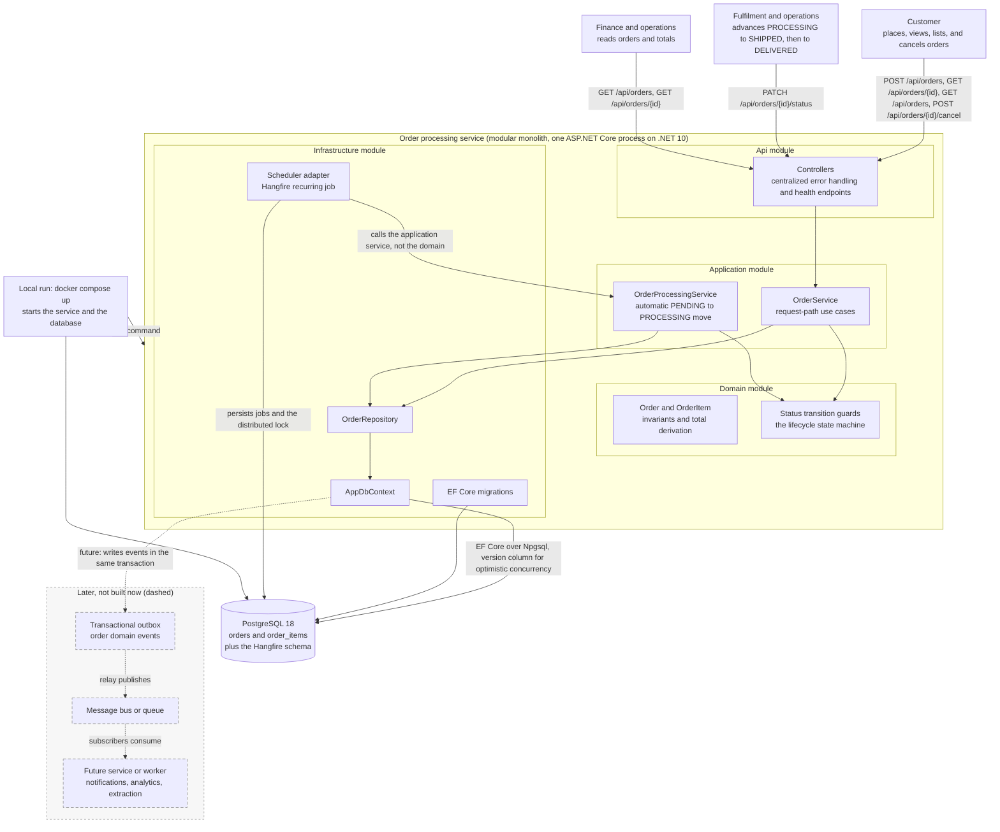
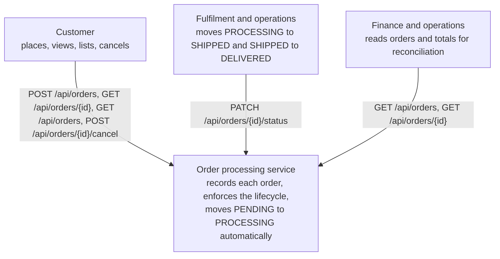
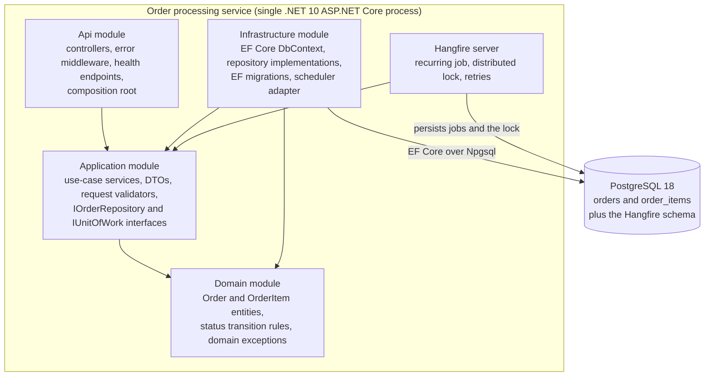
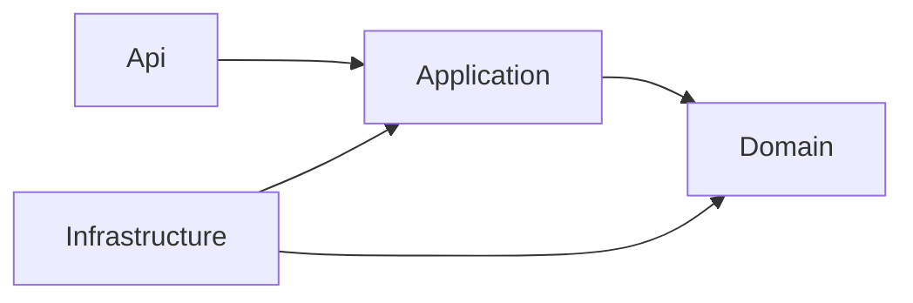

---
# Provenance frontmatter. Every field stays; approver is always human.
artifact_id: DOC-0001
artifact_type: c4
title: "C4 system context and container views for the order processing service"
status: approved
stage: S3
work_item: TKT-0001
author: { kind: agent, name: "sdlc-writer", model: "deepseek/deepseek-flash" }
reviewers:
  - { kind: agent, name: "sdlc-reviewer", model: "deepseek/deepseek-v4-pro", rounds: 2, verdict: approved }
  - { kind: agent, name: "sdlc-reviewer", model: "deepseek/deepseek-v4-pro", rounds: 1, verdict: approved }
  - { kind: agent, name: "sdlc-reviewer", model: "deepseek/deepseek-v4-pro", rounds: 1, verdict: approved }
approver: { kind: human, name: "Komal Bahetwar", role: "Architect", date: 2026-10-09 }
gate: G3
sources: [PRD-0001, ADR-0001, ADR-0002, ADR-0003, ADR-0008]
jurisdiction: []
created: 2026-10-09
updated: 2026-10-09
superseded_by: null
---

# C4 system context and container views for the order processing service

This document shows the order processing service at two levels: who uses it,
and how it is built. It is the structural view behind the stories in PRD-0001,
and it records the module boundaries a contributor is expected to respect.

## Overall architecture

The picture below is the product end to end: the programmatic callers, the
modular monolith and its four modules, the PostgreSQL store, and the scheduled
processing path. The request path runs from the controllers to the application
services, and the automatic move runs from the Hangfire recurring job to
`OrderProcessingService`, so the processing rule stays in the application layer
and the scheduler only triggers it. Everything drawn with a solid line exists
today: one ASP.NET Core process, its four modules, PostgreSQL 18, and the local
`docker compose up` that starts the service and the database. The dashed
elements are deliberately deferred, not built: a transactional outbox that would
capture order domain events and feed a message bus or queue, and any future
service or worker that subscribes to them.

## Scope

The change delivers a backend for order capture and lifecycle management behind
a programmatic interface. It has no user interface, no authentication, no
personal data, and no tenant boundary. The service is a modular monolith: one
deployable ASP.NET Core process that contains four code modules. The modules are
not independently deployable, so in C4 terms the process is the container and
the modules are its internal structure. We show them together because the
module boundaries are the part a contributor has to keep intact.

Stack: .NET 10, ASP.NET Core, EF Core 10 with Npgsql, PostgreSQL 18, and
Hangfire as the persistent scheduled-job library.

## Architecture style

The service is a modular monolith, recorded in ADR-0008: one deployable
ASP.NET Core process with four internal modules, Domain, Application,
Infrastructure, and Api, shown in the container view below. The modules are not
independently deployable, so the process is the C4 container and the modules are
its internal structure. Dependencies point one way, inward, so a change in the
store, the transport, or the scheduler stays in an outer module. The scheduler
runs in the same process as the request path today rather than as a separate
worker. The in-process scheduler posture is recorded in ADR-0003, and the path to
a separate worker or a queue consumer is recorded in ADR-0003 and
`docs/FUTURE_PHASES.md`.

## Level 1: system context

The service is the single system in scope. Everything it depends on is inside
it or is its data store, which appears in the container view. There is no
external identity provider, payment provider, catalogue, or notification
service; those are out of scope in PRD-0001.

## Level 2: container view

The container view has one deployable process and one data store. The scheduler
runs in the same process as the API because the Hangfire server is hosted there;
it is shown separately because its failure and scaling behavior is distinct
from the request path. Keeping the scheduler in process is a deployment choice,
not a domain dependency: the recurring job delegates to the Application module
and holds no rules.

### Module boundary map

| Module | Owns | May reference |
|---|---|---|
| Domain | Order and OrderItem entities, the status transition methods and their guards, the total derivation, domain exceptions | Nothing outside the .NET base libraries |
| Application | Use-case services (`OrderService` for the request path, `OrderProcessingService` for the automatic move), DTOs, request validators, `IOrderRepository`, `IUnitOfWork`, configuration options | Domain only |
| Infrastructure | EF Core `AppDbContext`, entity configuration, `OrderRepository`, EF migrations, the Hangfire recurring-job adapter | Application and Domain (implements the interfaces) |
| Api | Controllers, the centralized error handler, health endpoints, dependency injection, `Program.cs` | Application |

The Domain module is framework free: no EF Core, no ASP.NET Core, no Hangfire.
The Application module is also framework free and talks to persistence only
through its own interfaces. Infrastructure and Api are the composition roots
and adapt to the inner modules; they are the only places that know about EF
Core, HTTP, or Hangfire.

### Dependency direction

Dependencies point inward only. A change in the store, the transport, or the
scheduler stays in an outer module. This is the one-way direction recorded in
ADR-0001, and it is what lets the domain rules be tested with no database and
no HTTP request.

### Persistence and scheduling boundaries

`IOrderRepository` exposes only the operations the use cases need: load by id,
list with an optional status filter and a bound, load a pending batch, and add.
It does not expose `IQueryable` or EF Core types. `IUnitOfWork` owns the commit,
so application services decide when a request or a job batch is one
transaction and repositories never save on their own.

The scheduler adapter, the Hangfire recurring job, creates a service scope and
calls `IOrderProcessingService.ProcessPendingOrdersAsync`. The processing rule
and the status change live in Application and Domain, so the automatic move is
tested by invoking the service directly, with no scheduler and no waiting.
Hangfire's distributed lock and the optimistic concurrency token from ADR-0002
are the two layers that make the move safe across instances; both are recorded
in ADR-0003.

## Security posture

No threat model (catalog 6.1) is produced for this change, and that is a
deliberate decision reviewed here at G3. The service has no authentication or
authorization surface, captures no personal data, and has no tenant or
residency boundary, so the STRIDE-per-element exercise has no elements to
threaten beyond the two named below. This matches the no-regulatory position
in PRD-0001 and the tier-2 risk assessment in the runbook.

The trust boundaries that do exist are recorded so they are not lost:

- All HTTP input is untrusted and is validated at the edge, in the Api module,
  before any domain call.
- Data access is parameterized through EF Core; there is no string-built SQL.
- Money uses `decimal` and `numeric(18,2)`, not a floating type, and enum
  parsing is strict, so a malformed value is rejected rather than coerced.
- The administrative status change is the natural place for an authorization
  policy later, and cancel would require the caller to own the order. Those
  enforcement points are named here and deliberately not implemented, per the
  scope in PRD-0001. Adding either one is the trigger to produce a threat model
  and a revised authorization design.

## Related artifacts

The data model and migration design are in DOC-0002. The lifecycle, the
sequence diagrams, and the failure-mode notes are in DOC-0003. The deployment
and evolution view, including the scheduler's current in-process posture, is in
DOC-0004. The interface contract is `openapi/order-processing.yaml`. The
decisions behind this view are in ADR-0001 (layering), ADR-0002 (concurrency),
ADR-0003 (scheduling and multi-instance safety), and ADR-0008 (modular
monolith).
