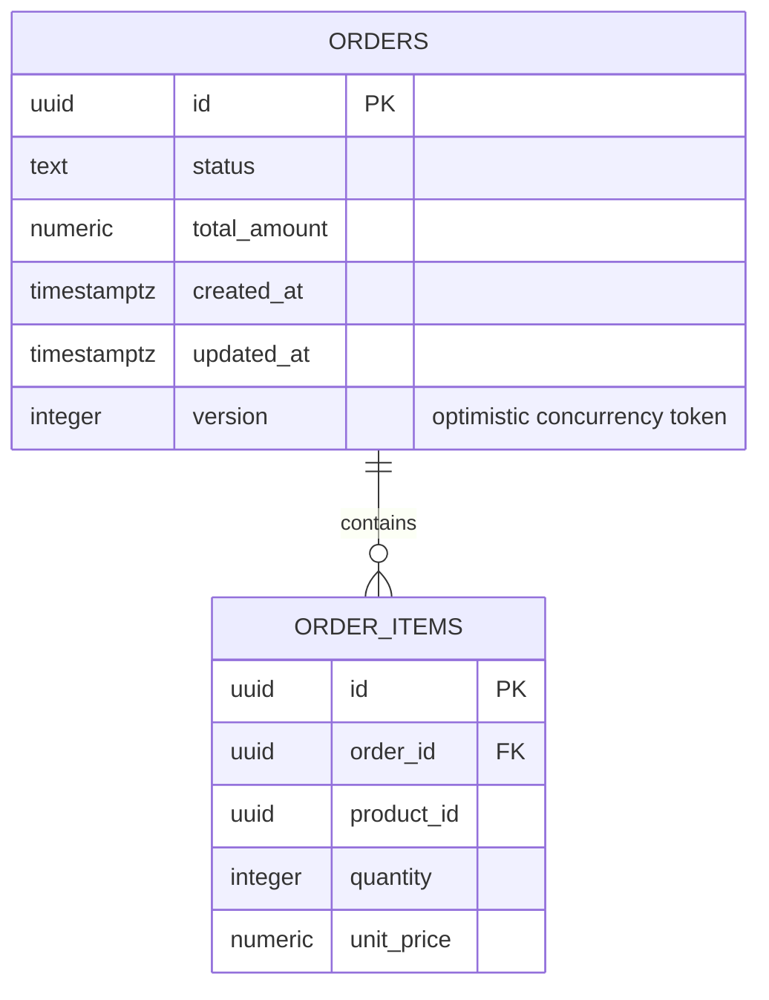

---
# Provenance frontmatter. Every field stays; approver is always human.
artifact_id: DOC-0002
artifact_type: data-model
title: "Data model and migration design for orders and order items"
status: approved
stage: S3
work_item: TKT-0001
author: { kind: agent, name: "sdlc-writer", model: "deepseek/deepseek-flash" }
reviewers:
  - { kind: agent, name: "sdlc-reviewer", model: "deepseek/deepseek-v4-pro", rounds: 2, verdict: approved }
  - { kind: agent, name: "sdlc-reviewer", model: "deepseek/deepseek-v4-pro", rounds: 1, verdict: approved }
approver: { kind: human, name: "Komal Bahetwar", role: "Architect", date: 2026-10-09 }
gate: G3
sources: [PRD-0001, NFR-0001, ADR-0002, ADR-0004, ADR-0007]
jurisdiction: []
created: 2026-10-09
updated: 2026-10-09
superseded_by: null
---

# Data model and migration design for orders and order items

This document is the persistence design for the order processing service. It
covers the conceptual model, the physical schema, the index strategy, the
concurrency token, the money representation, and how schema changes are
applied and reversed. The store is PostgreSQL 18, reached through EF Core 10
with Npgsql. The stack name appears here because persistence is a mechanism
choice owned by S3.

## Conceptual model

An order is the aggregate root. It holds exactly one status, a creation time, a
derived total, and one or more items. An item belongs to exactly one order and
records the product, the quantity, and the unit price agreed at order time.
Items are created with the order and are not edited afterward in this change.
The total is a property of the order derived from its items, not a stored input.

The same product may appear on more than one item row. The lines are kept
separate, per ADR-0007, so there is no uniqueness rule on order and product.

## Physical schema

### orders

| Column | Type | Nullable | Key or constraint | Notes |
|---|---|---|---|---|
| id | uuid | no | primary key | Generated once at creation. |
| status | text | no | check: one of PENDING, PROCESSING, SHIPPED, DELIVERED, CANCELLED | Stored as the uppercase enum name, matching the JSON contract. |
| total_amount | numeric(18,2) | no | | Derived from the items and written at creation. See the note below. |
| created_at | timestamptz | no | | UTC instant of creation. First ordering key. |
| updated_at | timestamptz | yes | | UTC instant of the last status change; null until the first change. |
| version | integer | no | default 0, concurrency token | Optimistic concurrency token. The application increments it on every update and the update predicate checks the value that was read. It is an ordinary column, so the mechanism is portable across relational databases. |

### order_items

| Column | Type | Nullable | Key or constraint | Notes |
|---|---|---|---|---|
| id | uuid | no | primary key | Generated once at creation. |
| order_id | uuid | no | foreign key to orders(id), on delete cascade | |
| product_id | uuid | no | | No foreign key; the product catalogue is out of scope in PRD-0001. |
| quantity | integer | no | check: greater than zero | Rejects a zero or negative quantity in the store as well as the domain. |
| unit_price | numeric(18,2) | no | check: not negative | The price agreed at order time. |

The line amount is not stored. The domain computes it as quantity times the
rounded unit price, rounded to two places, and returns it in the contract.

The total amount is stored on the order rather than recomputed on every read.
It is written from the items at creation time, and items are immutable after
creation in this change, so the stored total cannot drift from the items. The
concurrency token protects the order row, so a concurrent change cannot write a
total for a different set of items. The test strategy asserts that a read-back
total equals the sum of the item amounts.

## Index strategy

| Index | Columns | Reason |
|---|---|---|
| pk_orders | (id) | Primary key lookups for retrieve and for every change. |
| ix_orders_status_created_at | (status, created_at, id) | Serves the status-filtered list ordered by creation time, and the automatic move's scan of PENDING orders. The trailing id column makes the deterministic tie-break an index order rather than a sort. |
| ix_orders_created_at | (created_at, id) | Serves the unfiltered list ordered by creation time with the same deterministic tie-break. |
| pk_order_items | (id) | Primary key. |
| ix_order_items_order_id | (order_id) | Loads the items for an order and supports the cascade delete. |

There is no standalone index on status. The composite index leads with status,
so a status-only index would be a redundant second copy. The list bound is a
limit, not an offset, so no pagination index is needed beyond the ordering.

The list and the automatic move both order their reads by creation time
ascending and break ties by id ascending, which is the deterministic order
FR-5 and the list-bound budget in NFR-0001 require. Every index that serves an
ordering read includes id last so the order is fully determined.

## Concurrency token

Order changes use optimistic concurrency with an explicit integer `version`
column on the order, per ADR-0002. The application reads the order with its
version, increments the column on every write, and the update predicate checks
the version it read. The column is an ordinary part of the schema, so the
mechanism works on any relational database rather than relying on a
database-specific system column. EF Core treats `version` as a concurrency
token and appends `AND version = @original` to every update and delete for the
order. When the predicate matches no row, another writer changed the order
first, EF Core raises `DbUpdateConcurrencyException`, and the use case maps that
to a 409 conflict on the request path or to a log-and-skip in the automatic
move. The token is checked in the same transaction that loaded the aggregate,
which is what the single commit boundary from ADR-0001 provides.

The persistence design assumes the default `READ COMMITTED` isolation. Each
command changes one aggregate in one transaction, and no invariant spans two
aggregates, so a stronger isolation level would add contention without buying
correctness.

## Money representation

Amounts are fixed-scale decimals, per ADR-0004. In the store they are
`numeric(18,2)`: eighteen digits of precision and a scale of two. In C# they
are `decimal`. A caller-supplied unit price is accepted at up to two decimal
places, and any extra precision is rounded half-up to two decimals before the
line is computed. A line amount is then `quantity * unit_price` rounded half-up
(round half away from zero) to two places, and the order total is the sum of
the two-place line amounts. Amounts are non-negative here, so half-up and
half-away-from-zero are the same. The caller supplies unit prices and
quantities, never the total; a supplied total is ignored. This closes the
precision and rounding question in OQ-0001 and is the input rule the contract
documents.

## Migration design

Migrations are EF Core migrations targeting PostgreSQL. The rule is
forward-only with compensation: a shipped migration is never edited, and a
defect is corrected by a new forward migration that reverses the effect, so the
migration history is an accurate record of what ran when.

### Applying migrations

The service applies pending migrations at startup, before it reports ready, so
the operability budget in NFR-0001 holds: one command starts the service and
its data store, and required schema changes apply with no manual step. To keep
that safe when more than one instance starts at once, migrations run under a
PostgreSQL advisory lock, so one instance applies them and the others wait,
then continue. This is the same shape as the scheduler's distributed lock in
ADR-0003, and it matters because the service is designed to run as more than
one instance.

The Hangfire schema is created by Hangfire's PostgreSQL storage setup at
startup. It is separate from the application migrations, it lives in its own
tables, and application code never reads it. Readiness waits for both the
application store and the Hangfire store to be available.

### The initial migration

The first migration creates the schema above:

1. Create `orders` with its primary key, the status check constraint, the
   non-null columns, and the `version` concurrency column with its default of 0.
2. Create `order_items` with its primary key, the order foreign key with
   `ON DELETE CASCADE`, the quantity check, and the unit price check.
3. Create `ix_orders_status_created_at`, `ix_orders_created_at`, and
   `ix_order_items_order_id`.

### Reversing by compensation

Because migrations are forward-only, each class of change has a stated
compensation pattern:

- An added column or index is compensated by a later migration that drops it.
- A changed constraint is compensated by a later migration that restores the
  old constraint, after any offending rows are corrected.
- A data backfill is written to be safe to run twice, so a re-run after a
  partial failure converges rather than double-applies.
- A destructive change is never done in one step: the old shape is retired in a
  later release, after the new shape is proven, so a rollback of the service
  does not need a down migration.

### Data residency

The store holds orders and order items only. There is no personal data and no
tenant or region partition, consistent with the residency budget in NFR-0001:
single region, no personal data. A future change that adds either is the
trigger to revisit this design and produce the retention artifact the catalog
requires.

## Related artifacts

The structure that uses this store is in DOC-0001. The lifecycle and the
sequence diagrams are in DOC-0003. The external contract is
`openapi/order-processing.yaml`. The decisions behind the token, the money
type, and the duplicate-line rule are ADR-0002, ADR-0004, and ADR-0007.
