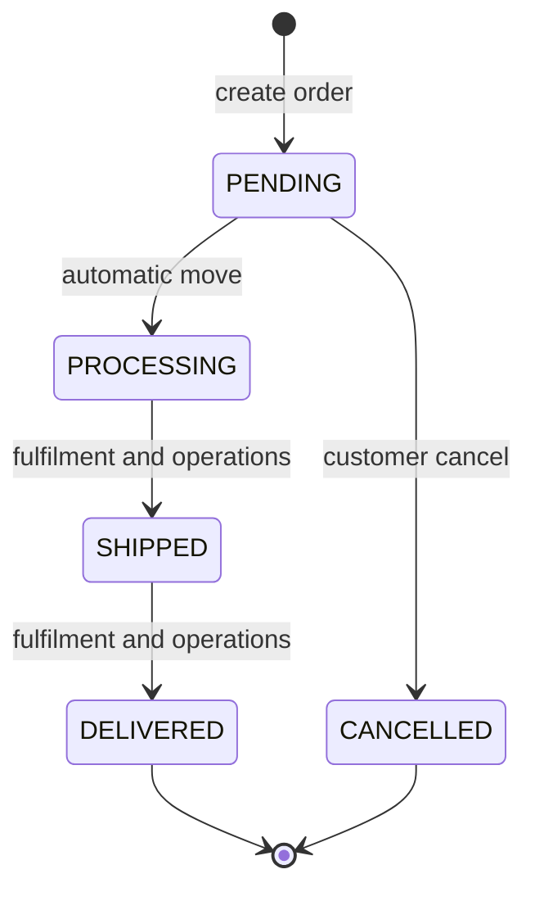
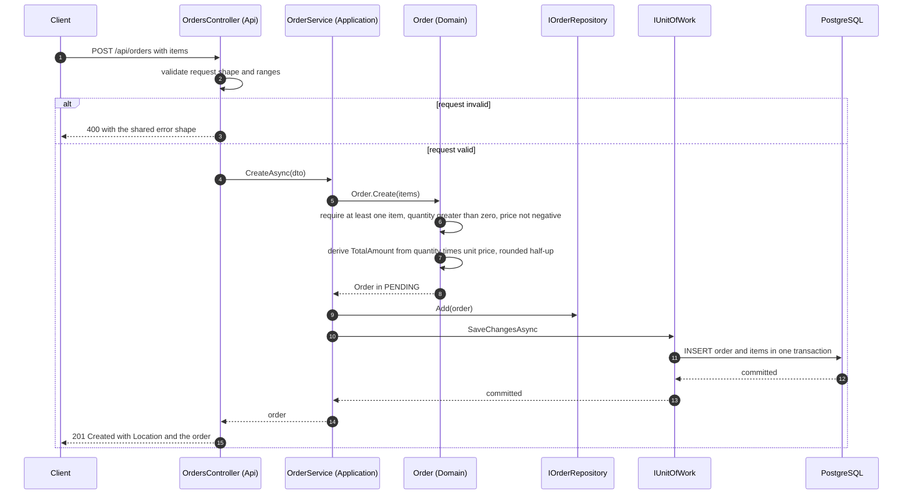
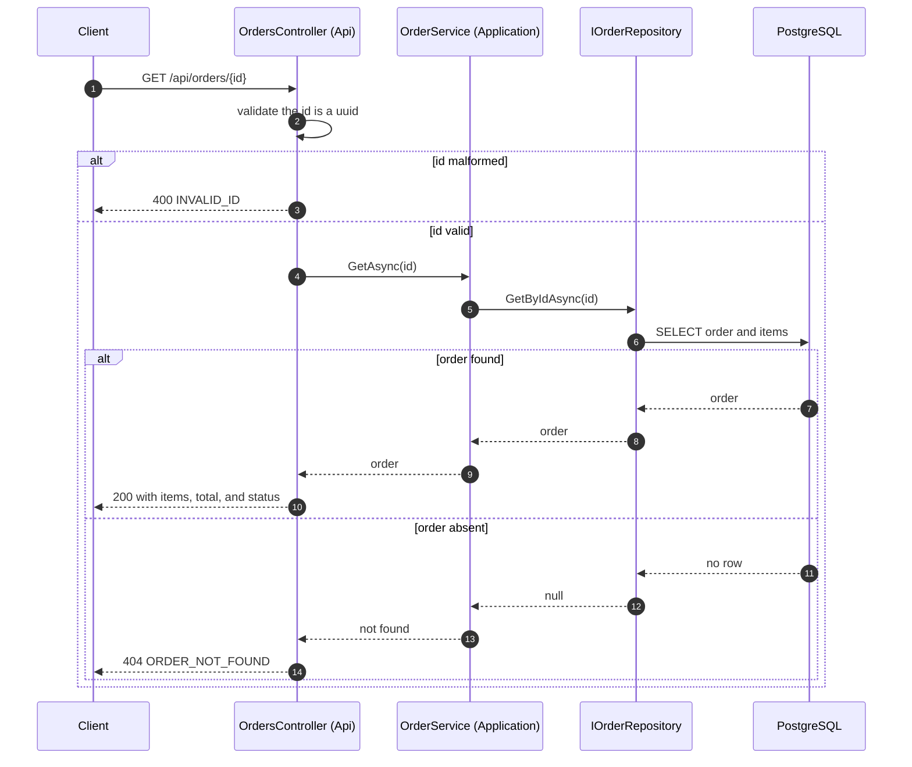
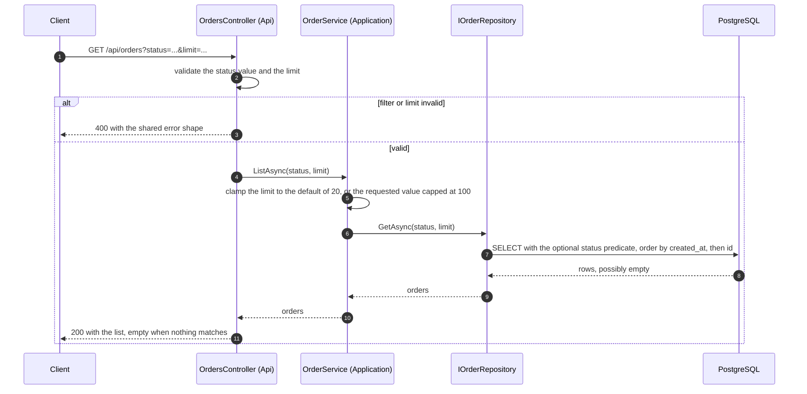
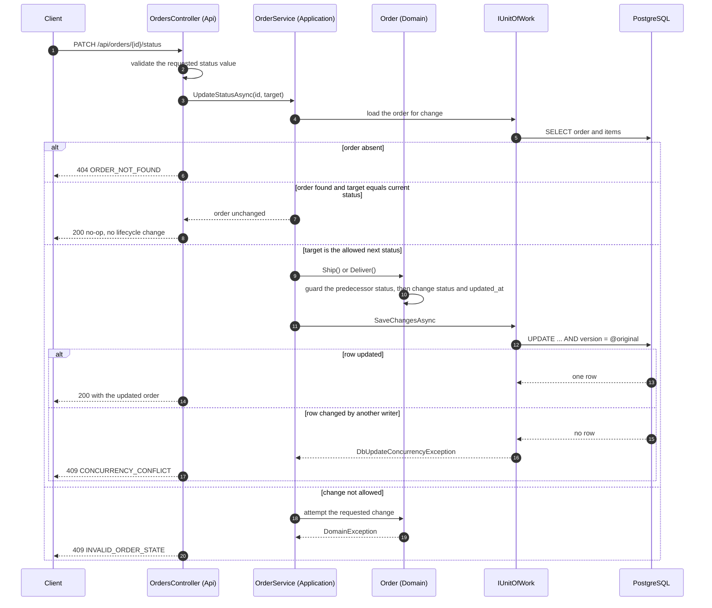
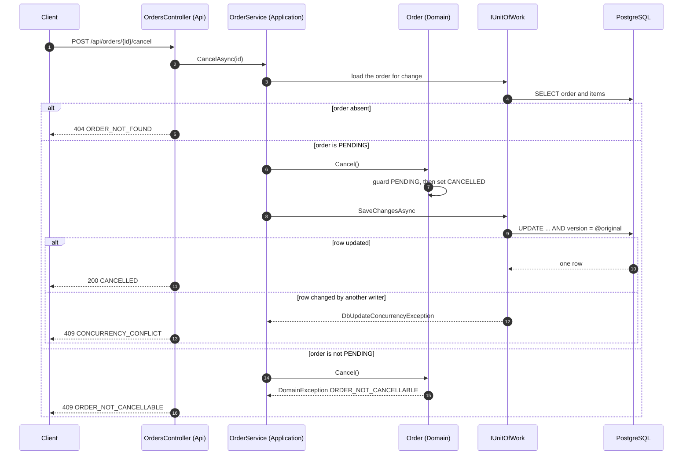
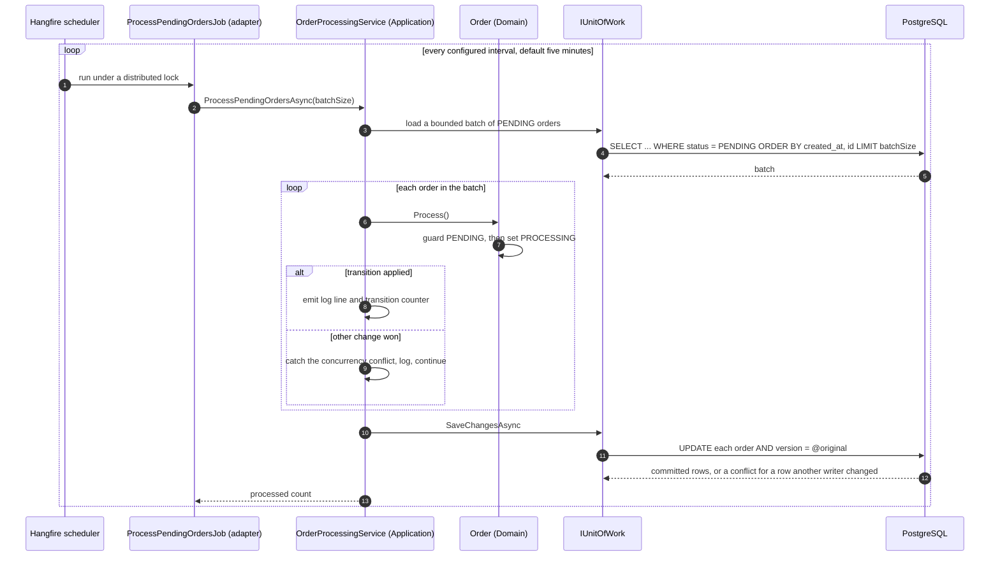
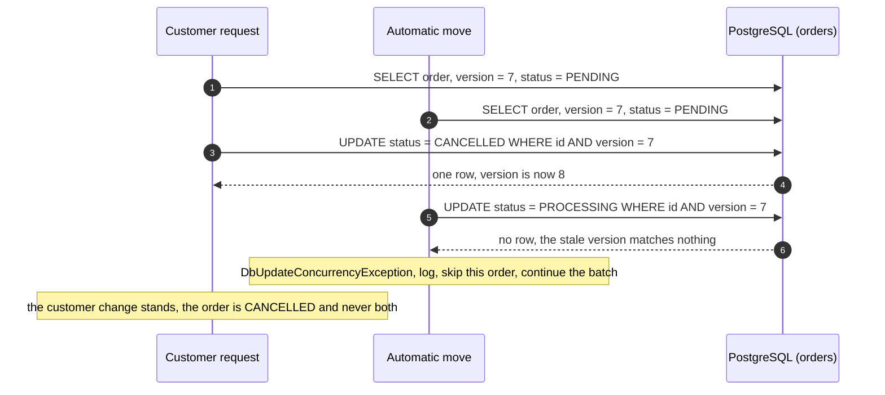

---
# Provenance frontmatter. Every field stays; approver is always human.
artifact_id: DOC-0003
artifact_type: doc
title: "Order lifecycle, sequence diagrams, and reliability notes"
status: approved
stage: S3
work_item: TKT-0001
author: { kind: agent, name: "sdlc-writer", model: "deepseek/deepseek-flash" }
reviewers:
  - { kind: agent, name: "sdlc-reviewer", model: "deepseek/deepseek-v4-pro", rounds: 2, verdict: approved }
  - { kind: agent, name: "sdlc-reviewer", model: "deepseek/deepseek-v4-pro", rounds: 1, verdict: approved }
approver: { kind: human, name: "Komal Bahetwar", role: "Architect", date: 2026-10-09 }
gate: G3
sources: [PRD-0001, NFR-0001, ADR-0002, ADR-0003, ADR-0006]
jurisdiction: []
created: 2026-10-09
updated: 2026-10-09
superseded_by: null
---

# Order lifecycle, sequence diagrams, and reliability notes

This document is the behavioral view of the order processing service. It gives
the state model and the allowed transitions, then walks the critical flows as
sequence diagrams, including the race between a cancel and the automatic move.
It closes with the failure-mode and reliability rules that make the change safe
under retries and more than one instance. The structural view is in DOC-0001
and the persistence design is in DOC-0002.

## State model

An order holds exactly one status at a time. There are five states and two are
terminal.

### Allowed transitions

| From | To | Trigger | Actor | Entry point |
|---|---|---|---|---|
| None | PENDING | Create an order | Customer | POST /api/orders |
| PENDING | PROCESSING | Automatic move | System, on behalf of fulfilment and operations | Scheduled recurring job |
| PENDING | CANCELLED | Cancel the whole order | Customer | POST /api/orders/{id}/cancel |
| PROCESSING | SHIPPED | Advance status | Fulfilment and operations | PATCH /api/orders/{id}/status |
| SHIPPED | DELIVERED | Advance status | Fulfilment and operations | PATCH /api/orders/{id}/status |
| Any | Same state | Repeat of the current status | Any caller | PATCH /api/orders/{id}/status |

Every other requested change is rejected with a 409 and the order keeps its
status. DELIVERED and CANCELLED are terminal: nothing moves out of them, and a
cancel on either is rejected. A same-status request is a 200 no-op, per
ADR-0006; it is not a transition and emits no lifecycle change.

The automatic move is the only path from PENDING to PROCESSING. We deliberately
do not expose that transition as a manual change: the status endpoint accepts
only PROCESSING to SHIPPED and SHIPPED to DELIVERED. The design context exposed
PENDING to PROCESSING for admin and testing, and we reject that option for now.
A manual request that targets PROCESSING from PENDING, or that targets PENDING
or CANCELLED at all, is rejected with a 409.

The status methods on the Order entity are the single authority for this table.
The application layer maps a requested target status to the named method and
lets the domain guard reject an illegal change. The controller never assigns a
status directly.

## Sequence diagrams

Participants are abbreviated: the client, the Api controller, the Application
use-case service, the Domain entity, the repository and unit of work, and
PostgreSQL.

### Create an order

The total is never accepted from the caller. Validation at the edge rejects a
malformed request with a 400; the domain constructor enforces the same
invariants and is the backstop if the edge is bypassed.

### Retrieve an order by id

Retrieval is read-only. It does not load the order for change, does not touch
the concurrency token, and never changes the order.

### List and filter orders

The order is oldest first by creation time with id as the deterministic
tie-break, so repeated reads over unchanged data return the same sequence. The
bound is applied after the filter. A requested limit above 100 succeeds and is
clamped to 100, matching the contract; it is not a validation error.

### Advance order status

The same-status branch is checked before a domain method is called, so it never
trips the guard. Every lifecycle change emits one structured log line and one
transition counter, per the observability budget in NFR-0001.

### Cancel an order

Cancellation is whole-order only. A cancel can arrive while the automatic move
is running; the race is handled in the last diagram below.

### Automatic move from pending to processing

Eligibility is simply status equal to PENDING. An order that has left PENDING,
including one that is CANCELLED, is not selected and is not touched. The
processing rule is in Application and Domain, so the whole flow is exercised by
calling the service directly, with no scheduler and no waiting.

### The race: cancel versus automatic move

Both writers read the same PENDING order with the same version, 7 in this
example. Each update carries the version it read.

Exactly one change applies. The winner is whichever committed first; the loser
reports a conflict on the request path (409) or is skipped by the automatic
move. The order never reflects both changes. This is the core case the
correctness under concurrent changes budget in NFR-0001 asks for, and the
mechanism is the optimistic token from ADR-0002.

## Failure modes and reliability

### Idempotency of the automatic move

The move is idempotent at three levels. The query selects only PENDING orders,
so an order it already moved is not selected again. The domain guard rejects
`Process()` unless the order is PENDING, so a reprocessing attempt on an order
that has moved on is a guard violation, not a second move. If two runs overlap,
the optimistic token makes the second write fail, and the loser is skipped. A
run over an unchanged set of orders therefore leaves the result identical to
the first run, which is what PRD-0001-S06 requires.

### Retries

The scheduler retries a failed recurring job with backoff, so a transient
database outage recovers without a manual step; the recurring schedule is
persisted in PostgreSQL, so a restart does not lose it. Retries are per job
run, not per order: a single contested or malformed order is caught, logged,
and skipped so it cannot fail the whole batch. On the request path there is no
silent retry. A change that loses a race reports 409, the change that is
illegal reports 409, and the caller decides what to do. This matches ADR-0002
and ADR-0006.

### Multi-instance safety

The service holds no request state in a single instance, so any instance can
serve any request. The automatic move is coordinated twice: Hangfire takes a
distributed lock per recurring job, so only one instance runs a given tick, and
the optimistic token makes each per-order update safe even if two runs overlap
across the lock boundary. Migrations run under a database advisory lock at
startup, so concurrent starts do not race the schema. Together these meet the
at-most-once and horizontal scalability budgets in NFR-0001, and the
arrangement is recorded in ADR-0003.

### Other failure paths

- Order not found: 404, and nothing is changed.
- Malformed id or request: 400 before any domain call.
- Illegal transition or cancel of a non-pending order: 409, and the order is
  untouched.
- Same-status repeat: 200 no-op, logged as a request but not as a lifecycle
  change.
- Duplicate submission of a create or a cancel is not suppressed in this
  change; a repeated create makes a second order and a repeated cancel after
  the order has moved returns 409. This is a known limitation recorded in
  ADR-0006, and a future idempotency key is the planned remedy.
- Database unavailable at startup: readiness stays not-ready until the store is
  reachable, so a caller is not routed to an instance that cannot serve.

## Related artifacts

The structural view is DOC-0001, the persistence design is DOC-0002, the
interface contract is `openapi/order-processing.yaml`, and the test coverage
for these flows is TP-0001.
