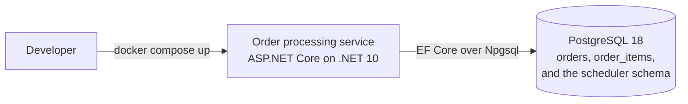

---
# Provenance frontmatter. Every field stays; approver is always human.
artifact_id: DOC-0004
artifact_type: doc
title: "Deployment, asynchronous integration, and evolution of the order processing service"
status: approved
stage: S3
work_item: TKT-0001
author: { kind: agent, name: "sdlc-writer", model: "deepseek/deepseek-flash" }
reviewers:
  - { kind: agent, name: "sdlc-reviewer", model: "deepseek/deepseek-v4-pro", rounds: 1, verdict: approved }
approver: { kind: human, name: "Komal Bahetwar", role: "Architect", date: 2026-10-09 }
gate: G3
sources: [DOC-0001, DOC-0002, DOC-0003, ADR-0003, ADR-0008]
jurisdiction: []
created: 2026-10-09
updated: 2026-10-09
superseded_by: null
---

# Deployment, asynchronous integration, and evolution of the order processing service

This document records how the order processing service is deployed today, how it
would integrate with the rest of a larger system later, and which changes to its
deployment and integration shape are deliberately deferred. It is the
deployment view (catalog 2.5) and the place where the integration evolution
(catalog 1.5) is written down. The structural view is in DOC-0001, the
persistence design is in DOC-0002, and the behavioral view is in DOC-0003.

## Current deployment

The service is a single deployable unit with a single data store. For the local
run, Docker Compose starts PostgreSQL 18 and the ASP.NET Core process, and the
service applies its pending EF Core migrations at startup before it reports
ready. That is the one-command local run the operability budget asks for:
nothing is applied by hand, and the store comes up with the service.

The scheduled processing runs in the same process as the request path. Hangfire
hosts the recurring job there, and the job handler delegates to
`IOrderProcessingService.ProcessPendingOrdersAsync`; the application service
holds the rule and the scheduler only triggers it. Keeping the scheduler
in-process is a deployment choice, not a domain dependency, and it is the
current posture recorded here.

The scaling unit is one instance. A second instance is safe. Requests are
stateless, the scheduler takes a distributed lock per recurring job so only one
instance runs a given tick, and the optimistic concurrency token makes each
order update safe even if two runs overlap across the lock. Migrations apply
under a database advisory lock, so concurrent starts do not race the schema.
ADR-0003 records the scheduling and multi-instance arrangement, and DOC-0002
records how migrations apply.

## Deployment evolution

None of the steps below are built now. Each one moves into a new NFR delta and
its normal lifecycle when its trigger fires, and each stays out of committed
scope until then.

| Concern | Future step, not built now | Trigger |
|---|---|---|
| Container packaging and orchestration | Package the service as a container image and run it on an orchestrator | The service runs anywhere other than the local compose environment |
| Managed database | Move the store to a managed PostgreSQL service with automated backups | The service is operated beyond a local environment, or the store has to survive a host failure |
| Blue/green or rolling deployment with automated rollback | Deploy without downtime and roll back automatically on a failed health check | The service has an availability target that a restart would breach |
| Backups and disaster recovery | Scheduled backups, a tested restore, and a named recovery objective | The service holds data that cannot be regenerated, or a recovery time is promised |
| Read replicas | Serve read and list traffic from read replicas | Read traffic grows faster than write traffic |
| Multi-region operation | Run in more than one region with regional routing | A residency obligation or an availability target demands a second region |

## Asynchronous integration posture

There is no message broker and no queue today. The only asynchronous behavior is
the automatic move from PENDING to PROCESSING, and it is a scheduled job rather
than a message consumer: Hangfire runs the recurring job on a cron expression,
and the job calls the application service. Nothing is published and nothing is
subscribed, so no other component depends on the order service's schema or
release cycle yet.

The future path is domain events through a transactional outbox. When a consumer
appears, the service would record order events (order created, status changed,
and cancelled) in an outbox table in the same transaction that changes the
order, and a relay would publish them to a message bus or queue. Consumers such
as notifications, analytics, and any future service would subscribe to those
events instead of reading the order store or calling back into the service, so
they stay decoupled from its internals. The outbox is what keeps the publish
step from creating a dual-write problem: the event commits with the state
change, so a crash between the two cannot lose or invent an event.

The trigger is a real consumer that should not depend on the order service
directly, for example notifications on status change or an analytics pipeline.
The trade-off is eventual consistency and outbox maintenance. Consumers see
events after the change commits rather than during it, so a consumer that needs
read-your-writes has to handle that delay, and the outbox table needs a relay,
ordering care, and idempotent consumers. We take that cost on only when a
consumer justifies it.

## Related artifacts

The modules and the dependency direction are in DOC-0001. The data model and how
migrations apply is in DOC-0002. The scheduler and multi-instance safety are in
DOC-0003 and ADR-0003. The architecture style and the triggers that would make
extraction worthwhile are in ADR-0008.
